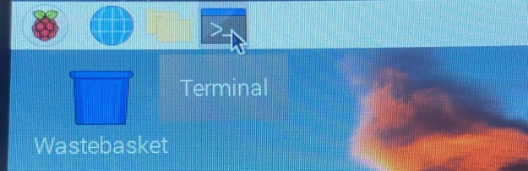
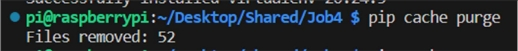

GOOGLE VISION API WITH 

RASPBERRY PI 

GOOGLE VISION API WITH RASPBERRY PI 

MỤC LỤC 

MỤC LỤC................................................................................................................................. 2 CHƯƠNG 1: MÔI TRƯỜNG PHÁT TRIỂN RASPBERRY CHO AI VISION............... 5 

1. Giới thiệu về Raspberry PI............................................................................................... 5 
1. Chuẩn bị phần cứng ......................................................................................................... 6 
1. Cài đặt hệ điều hành ......................................................................................................... 7 
1. Cài đặt Raspbian ..................................................................................................... 7 
1. Cài đặt SD Card Formatter ............................................................................ 7 
1. Cài đặt Raspberry Pi ...................................................................................... 9 
1. Cài đặt Win32 Disk Imager ......................................................................... 10 
2. Cài đặt ban đầu cho Raspbian ............................................................................... 16 
4. Cài đặt mạng .................................................................................................................. 16 
1. Mạng có dây .......................................................................................................... 16 
1. Wi-Fi ..................................................................................................................... 16 
5. Cài đặt Samba ................................................................................................................ 17 
1. Cài đặt Samba ....................................................................................................... 17 
1. Truy cập tài nguyên được chia sẻ ......................................................................... 20 
6. Giới thiệu về GPIO ........................................................................................................ 21 
7. Cài đặt thư viện GPIO.................................................................................................... 22 

7\.1. Cài đặt WiresPi ..................................................................................................... 22 

1. Cài đặt GIT .................................................................................................. 22 
1. Tải xuống thư viện WiringPi ....................................................................... 23 
1. Xây dựng thư viện WiringPi ........................................................................ 23 
1. Xác nhận việc cài đặt ................................................................................... 23 
8. Hướng dẫn phát triển hệ thống ...................................................................................... 25 
1. Viết chương trình .................................................................................................. 25 
1. Dịch chương trình ................................................................................................. 25 
1. Chạy chương trình ................................................................................................ 25 

CHƯƠNG 2: NHẬN DẠNG HÌNH ẢNH BẰNG GOOGLE VISION ............................. 26 

1. Giới thiệu về Google Vision .......................................................................................... 26 
1. Thành phần và đặc điểm của gt-AI Vision .................................................................... 28 
1. Đặc điểm kỹ thuật sản phẩm ................................................................................. 28 
1. Thành phần sản phẩm ........................................................................................... 29 
1. Cấu hình hệ thống nhận dạng AI ................................................................. 31 
1. Cấu hình công tắc hệ thống nhận dạng hình ảnh ......................................... 31 
3. Xây dựng môi trường phát triển Google Vision ............................................................ 33 
1. Tạo dự án Google Vision API: ............................................................................. 33 
1. Cài đặt Client Library ........................................................................................... 34 
1. Cài đặt Python 3 (nếu chưa có): ................................................................... 34 
1. Cài đặt pip (nếu chưa có): ............................................................................ 35 
3. Cài đặt virtualenv ......................................................................................... 35 
3. Tạo một môi trường ảo có tên là "ai-env" sử dụng Python 3 ...................... 36 
3. Kích hoạt môi trường ảo .............................................................................. 36 
3. Cài đặt Client Library .................................................................................. 37 
3. Xác thực tài khoản ....................................................................................... 37 
3. Chạy thử ................................................................................................................ 38 CHƯƠNG 3: NHẬN DẠNG HÌNH ẢNH BẰNG GOOGLE VISION 1 .......................... 40 
1. Phát hiện nhãn ................................................................................................................ 40 
1. Giới thiệu phát hiện nhãn ...................................................................................... 40 
1. Phương pháp phát hiện nhãn và cài đặt thư viện cần thiết.................................... 41 
1. Hướng dẫn chi tiết mã nguồn ................................................................................ 41 
1. Import các thư viện cần thiết ....................................................................... 41 
1. Thiết lập thông tin xác thực ......................................................................... 41 
1. Khởi tạo client của Vision API .................................................................... 42 
1. Định nghĩa hàm detect\_labels(path) ............................................................ 42 
1. Sử dụng hàm ................................................................................................ 42 
4. Chi tiết mã nguồn .................................................................................................. 42 
5. Kết quả nhận được ................................................................................................ 43 
2. Phát hiện văn bản ........................................................................................................... 44 
1. Giới thiệu phát hiện nhãn ...................................................................................... 44 
1. Phương pháp phát hiện văn bản và cài đặt thư viện cần thiết ............................... 44 
1. Hướng dẫn chi tiết mã nguồn ................................................................................ 45 
1. Import các thư viện cần thiết ....................................................................... 45 
1. Thiết lập thông tin xác thực ......................................................................... 45 
1. Khởi tạo client của Vision API .................................................................... 45 
1. Định nghĩa hàm detect\_texts(path) .............................................................. 45 
1. Sử dụng hàm ................................................................................................ 46 
4. Chi tiết mã nguồn .................................................................................................. 46 
5. Kết quả nhận được ................................................................................................ 47 

CHƯƠNG 4: NHẬN DẠNG HÌNH ẢNH BẰNG GOOGLE VISION 2 .......................... 48 

1. Nhận diện khuôn mặt ..................................................................................................... 48 
1. Mục đích đoạn mã ................................................................................................. 48 
1. Cấu trúc thư mục ................................................................................................... 49 
1. Cài đặt các gói cần thiết ........................................................................................ 49 
1. Hướng dẫn chi tiết................................................................................................. 49 
1. Import các thư viện cần thiết ....................................................................... 49 

   2. Thiết lập thông tin xác thực ......................................................................... 50 

      3. Khởi tạo client của Vision API .................................................................... 50 
      3. Định nghĩa hàm detectFace(FILE\_PATH) .................................................. 50 
      3. Sử dụng hàm ................................................................................................ 52 
4. Chi tiết mã nguồn .................................................................................................. 52 
5. Kết quả nhận được ................................................................................................ 52 
2. Phát hiện biểu cảm khuôn mặt ....................................................................................... 54 
1. Mục đích đoạn mã ................................................................................................. 54 
1. Cấu trúc thư mục ................................................................................................... 55 
1. Cài đặt các gói cần thiết ........................................................................................ 55 
1. Hướng dẫn chi tiết................................................................................................. 55 
1. Import các thư viện cần thiết ....................................................................... 55 

   2. Thiết lập thông tin xác thực ......................................................................... 56 

      3. Khởi tạo client của Vision API .................................................................... 56 
      3. Định nghĩa hàm detectFace(FILE\_PATH) .................................................. 56 
      3. Sử dụng hàm ................................................................................................ 57 
4. Chi tiết mã nguồn .................................................................................................. 57 
5. Kết quả nhận được ................................................................................................ 58 
3. Tìm Landmark ............................................................................................................... 59 CHƯƠNG 5: NHẬN DIỆN THUỘC TÍNH VÀ TÌM KIẾM AN TOÀN ......................... 60 
1. Phát hiện thuộc tính hình ảnh......................................................................................... 60 
1. Giới thiệu về phát hiện thuộc tính hình ảnh .......................................................... 60 
1. Phương pháp phát hiện thuộc tính hình ảnh ......................................................... 60 
1. Cài đặt thư viện cần thiết ............................................................................. 60 
1. Chuẩn bị kho chứa hình ảnh ........................................................................ 60 
3. Hướng dẫn mã nguồn chi tiết ................................................................................ 61 
1. Import các thư viện cần thiết: ...................................................................... 61 
1. Thiết lập thông tin xác thực: ........................................................................ 61 
1. Khởi tạo client của Vision API: ................................................................... 61 
1. Định nghĩa hàm detect\_properties(image\_path\_or\_uri): ............................. 61 
1. Gọi Vision API và trích xuất thông tin về màu sắc: .................................... 62 
1. In thông tin về màu sắc: ............................................................................... 62 
7. Gọi hàm detect\_properties cho một hình ảnh cục bộ hoặc một URL hình ảnh: ......................................................................................................................... 62 
4. Mã nguồn chi tiết .................................................................................................. 63 
4. Kết quả nhận được ................................................................................................ 64 
2. Phát hiện tìm kiếm an toàn............................................................................................. 64 
1. Giới thiệu về phát hiện thuộc tính hình ảnh ........................................................... 64 

   2. Phương pháp phát hiện thuộc tính hình ảnh ......................................................... 64 
1. Cài đặt thư viện cần thiết ............................................................................. 65 
1. Chuẩn bị kho chứa hình ảnh ........................................................................ 65 
3. Hướng dẫn mã nguồn chi tiết ................................................................................ 65 
1. Import các thư viện cần thiết: ...................................................................... 65 
1. Thiết lập thông tin xác thực: ........................................................................ 66 
1. Khởi tạo client của Vision API: ................................................................... 66 
1. Định nghĩa hàm detect\_safe\_search(image\_path\_or\_uri): .......................... 66 
5. Gọi Vision API và trích xuất thông tin về tìm kiếm an toàn: ...................... 66 
5. Khởi tạo trạng thái và in thông tin về màu sắc: ........................................... 67 
7. Gọi hàm detect\_safe\_search cho một hình ảnh cục bộ hoặc một URL hình ảnh: ......................................................................................................................... 67 
4. Mã nguồn chi tiết .................................................................................................. 67 
4. Kết quả nhận được ................................................................................................ 68 

CHƯƠNG 1: MÔI TRƯỜNG PHÁT TRIỂN RASPBERRY CHO AI VISION 

1. Giới thiệu về Raspberry PI 

Raspberry Pi (viết tắt là "RasPi") là một máy tính kích thước một thẻ tín dụng, được phát triển bởi Raspberry Pi Foundation ở Vương quốc Anh. Nó được thiết kế để cung cấp một nền tảng giá rẻ và dễ dàng sử dụng cho việc học lập trình và thực hiện các dự án điện tử. Raspberry Pi sử dụng một phiên bản của hệ điều hành Linux (thường là Raspbian hoặc Raspberry Pi OS) và có các cổng kết nối để kết nối với màn hình, bàn phím, chuột và các thiết bị ngoại vi khác. 

Raspberry Pi đã trở thành một công cụ phổ biến cho việc học lập trình, phát triển phần mềm, xây dựng dự án IoT (Internet of Things), và tạo ra các ứng dụng sáng tạo. Nó có sẵn ở nhiều phiên bản với sự nâng cấp về hiệu suất và tính năng, và có một cộng đồng đông đảo của người dùng và nhà phát triển trên khắp thế giới. Raspberry Pi cung cấp một cơ hội học hỏi và thử nghiệm công nghệ mới một cách tiết kiệm và thú vị. 

2. Chuẩn bị phần cứng 

Để cài đặt Raspberry Pi, bạn cần chuẩn bị các điều kiện sau: 

|Thiết bị Raspberry Pi |Bạn cần có một board Raspberry Pi, ví dụ như Raspberry Pi 4, Raspberry Pi 3, hoặc Raspberry Pi Zero. Lựa chọn board cụ thể phụ thuộc vào mục đích sử dụng của bạn. ||
| :- | - | - |
|Thẻ microSD |Bạn cần một thẻ microSD có dung lượng ít nhất 8GB hoặc lớn hơn. Thẻ này sẽ được sử dụng để lưu hệ điều hành và dữ liệu của bạn. ||
|Adapter nguồn |Cần một adapter nguồn micro USB có điện áp phù  hợp với board Raspberry Pi  bạn đang sử dụng. ||

|Bàn phím và chuột (tùy chọn) |Nếu bạn định sử dụng Raspberry Pi như một máy tính cá nhân, bạn sẽ cần bàn phím và chuột để tương tác với nó. Bạn cũng có thể sử dụng bàn phím và chuột không dây. ||
| :-: | - | - |
|Màn hình (tùy chọn) |Nếu bạn không sử dụng SSH để điều khiển từ xa, bạn cần một màn hình để kết nối với Raspberry Pi. ||
|Máy tính khác |Bạn  cần  một  máy  tính  khác  để  tạo  thẻ microSD và tải hệ điều hành cho Raspberry Pi. ||
|Hệ điều hành Raspberry Pi |Bạn cần tải hệ điều hành cho Raspberry Pi, ví  dụ  như  Raspberry  Pi  OS,  Ubuntu, Raspbian, hoặc các biến thể khác. ||

3. Cài đặt hệ điều hành 
1. Cài đặt Raspbian 
1. Cài đặt SD Card Formatter 

Ứng dụng SD Card Formatter là một công cụ giúp bạn định dạng thẻ SD một cách dễ dàng và hiệu quả. Điều này có thể hữu ích khi bạn muốn chuẩn bị lại thẻ SD để sử dụng cho mục đích khác hoặc khi thẻ SD của bạn gặp vấn đề và bạn muốn định dạng lại nó để khắc phục lỗi.  

Hướng dẫn cài đặt và sử dụng SD Card Formatter: 

Bước 1: Tải và cài đặt SD Card Formatter 

Truy cập tại đây để tải xuống ứng dụng dành cho window. 

Tải xuống phiên bản phù hợp với hệ điều hành và sau đó chạy tệp cài đặt để cài đặt ứng dụng lên máy tính. 

Bước 2: Gắn thẻ SD vào máy tính 

Sử dụng đầu đọc thẻ SD hoặc khe cắm SD trên máy tính để gắn thẻ SD cần định dạng vào máy tính 

Bước 3: Khởi động SD Card Formatter 

Mở ứng dụng sau khi cài xong, có thể 1 số trường hợp cần cấp quyền administrator để chạy ứng dụng 

Bước 4: Chọn thiết bị và định dạng: 

Trong giao diện của SD Card Formatter, ứng dụng sẽ hiển thị danh sách các thiết bị lưu trữ ngoại vi đã kết nối với máy tính. Cần chắc chắn chọn đúng thẻ SD muốn định dạng. 

Sau đó nhấn vào nút Format (Định dạng) để bắt đầu quá trình định dạng của thẻ SD, trong quá trình này, tất cả dữ liệu trên thẻ SD sẽ bị xóa. 

Bước 5: Hoàn tất định dạng 

Quá trình định dạng sẽ diễn ra và sau khi hoàn tất, bạn sẽ nhận được thông báo. 

Lưu ý quan trọng: Hãy cẩn thận khi sử dụng SD Card Formatter, vì nó sẽ xóa hoàn toàn dữ liệu trên thẻ SD mà bạn đã chọn. Hãy đảm bảo sao lưu dữ liệu quan trọng trước khi tiến hành định dạng. 

2. Cài đặt Raspberry Pi 

Truy  cập  trang  web  chính  thức  của  Raspberry  Pi  Foundation  tại https://www.raspberrypi.com/software/operating-systems  

Trang web này cung cấp danh sách các hệ điều hành khác nhau dành cho Raspberry Pi. Tiếp theo chọn hệ điều hành muốn cài đặt. Raspberry Pi OS (Trước đây là Raspbian) là một lựa chọn phổ biến cho người mới bắt đầu. Chọn bản Raspberry Pi OS with desktop 

Giải nén tệp đã tải xuống sẽ tạp một tệp hình ảnh (.img) có cùng tên. Tuy nhiên, ta cần cài thêm Win32 Disk Imager để có thể ghi được hệ điều hành vào thẻ nhớ  

3. Cài đặt Win32 Disk Imager 

Win32 Disk Imager là ứng dụng miễn phí và mã nguồn mở được sử dụng để ghi hệ điều hành và dữ liệu lên các thiết bị lưu trữ ngoại vi như thẻ SD hoặc USB. Đây là công cụ phổ biến để cài đặt hệ điều hành như (Raspberry Pi OS, Ubuntu, Windows IoT Core) lên thẻ SD cho các dự án IoT hoặc để tạo bản sao dự phòng trên thẻ SD. 

Cách cài đặt Win32 Disk Imager: 

Bước 1: Tải Win32 Disk Imager 

Truy cập trang web chính thức của Win32 Disk Imager tại đây. Trang web này chức các phiên bản mới nhất của Win32 Disk Imager. Hãy tìm và tải xuống phiên bản phù hợp với hệ điều hành của bạn.

Bước 2: Cài đặt Win32 Disk Imager 

Khi tải xong, bạn hãy mở tệp đã tải xuống. Trong quá trình cài đặt, bạn sẽ được hỏi về vị trí cài đặt và tùy chọn cài đặt khác, hãy làm theo hướng dẫn trên màn hình để hoàn tất quá trình cài đặt. 

Hình 1: Chấp nhận giấy phép và tiếp tục nhấn vào next 

Hình 2: Lựa chọn thư mục để cài đặt và chọn next 

Hình 3: Lựa chọn thư mục Start menu và tiếp tục next 

Hình 4: Lựa chọn thêm một biểu tượng lối tắt vào màn hình desktop rồi tiếp tục chọn next 

Hình 5: Kiểm tra nội dung đã cài đặt và nếu không phát sinh lỗi, tiếp tục quá trình 

Hình 6: Tiếp tục quy trình cài đặt 

Hình 7: Cài đặt hoàn tất 

Bước 3: Khởi động chương trình 

Sau khi cài đặt, chương trình sẽ tự động được chạy. Lắp thẻ nhớ micro SD vào đầu đọc thẻ nhớ, kết nối nó với máy tính và khởi động lại chương trình từ đường dẫn đã cài đặt. Tiếp tục chọn đúng đường dẫn file Raspberry Pi đã tải xuống ở hướng dẫn phần trước. 

Hình 1: Giao diện chọn đường dẫn

Hình 2: Một cửa sổ được tạo để xác nhận tiến trình, sau đó nhấp vào “Yes” 

Hình 3: Một cửa sổ hiện lên thông báo việc Ghi thành công 

Khi đã ghi xong tệp, bấm OK để xác nhận và nhấn EXIT để thoát khỏi chương trình. Tháo thẻ nhớ để thực hiện các bước tiếp theo 

2. Cài đặt ban đầu cho Raspbian 
4. Cài đặt mạng 

Có thể xây dựng môi trường mạng bằng cách kết nối cáp LAN với mạng hiện có hoặc sử dụng LAN không dây có Wifi tích hợp. Theo mặc định, DHCP được đặt để tự động gán IP. Ngoài ra, có thể thiết lập giao tiếp không dây tầm ngắn thông qua Bluetooth tích hợp. 

1. Mạng có dây 

Nếu sử dụng cáp, hãy cắm cổng LAN vào mạch Raspberry Pi và nó sẽ tự động được gán cho một địa chỉ IP. Tại thời điểm này, có thể kiểm tra xem liệu cài đặt mạng có được thực hiện bình thường hay không thông qua biểu tượng cài đặt mạng nằm ở góc bên phải. Đặt con trỏ chuột lên biểu tượng này để hiển thị IP được gán. 

2. Wi-Fi 

Nếu bạn đang sử dụng Wifi, hãy nhấp vào biểu tượng Cài đặt mạng nằm bên cạnh biểu tượng loa ở góc trên cùng bên phải và sẽ thấy danh sách Áp được nhận dạng qua Wifi tích hợp trong Raspberry Pi. Chọn AP muốn sử dụng từ danh sách và nhập mật khẩu cho trước (Mật khẩu AP có liên quan). Sau khi đặt lại con trỏ chuột trên biểu tượng cài đặt mạng, có thể kiểm tra SSID và địa chỉ IP được gán. 

5. Cài đặt Samba 

Khi một mạng được thiết lập bằng hệ điều hành, việc chia sẻ tài nguyên có thể là cần thiết từ một ổ đĩa của PC hiện có. Ngay cả khi tại chương trình để điều khiển các thiết bị khác nhau của thiết bị gt – AI. Trước tiên phải sao chép và sử dụng thư viện đã tạo. Trong trường hợp này, một giao thức gọi là SAMBA được sử dụng để chia sẻ tệp từ các hệ thống khác nhau. 

SMB (Server Message Block – Khối bản tin máy chủ), như đã đề cập trước đó, là một giao thức được phát triển để cho phép một hệ thống (Windows) chia sẻ các tài nguyên như đĩa và máy in trên một hệ thống khác 

Trong trường hợp này, chúng ta chia sẻ các tệp cho Windows cho Raspberry. HĐH hiện tại được cấu hình cho Samba. Nhưng đối với HĐH cần cấu hình nó, cần phải xem xét mục dưới đây. 

1. Cài đặt Samba 

Chạy Terminal bằng cách nhấp vào biểu tượng như bên dưới (Hoặc có thể dùng Terminal trong VS Code) 

Cập nhật apt-get bằng câu lệnh: sudo apt-get update 

Lệnh này cập nhật danh sách các package có sẵn và các phiên bản của chúng. Nó được sử dụng để kiểm tra và thông báo nếu gói có phiên bản mới hơn thay vì nâng cấp phiên bản. Vì các cập nhật được thực hiện thông qua internet, nên việc setup mạng cần được thực hiện trước. 

Nâng cấp apt-get update bằng cách gõ lệnh sau đây: sudo apt-get upgrate 

Và tiếp tục chọn Y trong trường hợp được xác nhận Bạn có muốn tiếp tục không? [Y/n]. Lệnh này nâng cấp các gói lên phiên bản mới nhất. 

Cài gói samba bằng cách nhập lệnh: sudo apt-get install samba samba-common-bin 

Tạo một thư mục mà bạn muốn chia sẻ. Ví dụ, tạo một thư mục có tên "Shared" bằng lệnh sau: 

Sau đó, bạn cần cấu hình Samba để chia sẻ thư mục này. Mở tệp cấu hình Samba bằng lệnh: sudo nano /etc/samba/smb.conf 

Tìm đoạn [global] và thêm dòng sau để cho phép chia sẻ thư mục trong Samba: 

Cuối tệp cấu hình, thêm phần sau để định nghĩa thư mục chia sẻ: 

Khi hoàn tất, nhấn Ctrl + X để thoát trình chỉnh sửa. Nếu nội dung được chỉnh sửa tại thời điểm này, trình chỉnh sửa sẽ xác nhận có lưu nội dung đã thay đổi hay không. Nhấn “y” để lưu nội dung và nhấn “Enter” để thoát. 

Sử dụng lệnh sau để đặt ID người dùng và mật khẩu để được sử dụng khi kết nối với Samba. ID người dùng được đặt thành pi và mật khẩu là tự đặt. 

Chạy lại samba để áp dụng các cài đặt: sudo systemctl restart smbd 

Bây giờ, ta có thể truy cập thư mục share của Raspberry Pi bằng máy tính cá nhân như sau. 

2. Truy cập tài nguyên được chia sẻ 

Mở Windows Explorer và nhập địa chỉ IP mạng được gán trong trường thư mục trên để truy cập thư mục đã chia sẻ của Raspberry Pi. 

Khi kết nối, sử dụng ID và mật khẩu đã đặt, và khi đó có thể được tạo, sửa đổi, sao chép và xóa file trong thư mục. (Nhấp chọn vào Remember my credentials) nếu không muốn nhập  mật khẩu trong các lần tiếp theo. 

Nếu truy cập vào thư mục chia sẻ không được trơn tru, hãy kiểm tra IP được gán và kiểm tra xem IP được gán có được kết nối đúng với mạng thông qua kiểm tra ping hay không. Kiểm tra Ping bằng cách nhập “ping [ip\_address]” trong cửa sổ lệnh của mỗi thiết bị. 

6. Giới thiệu về GPIO 

Raspberry Pi là phiên bản thu nhỏ của máy tính phổ biến trong cuộc sống hàng ngày. Điều đó có nghĩa là có thể xem video, làm công việc giấy tờ và lướt web thông qua Raspberry Pi. Hơn nữa, nó có đầu nối GPIO mà không có trong máy tính thông thường, nên tín hiệu I/O có thể được điều khiển như vi điều khiển. 

GPIO (Đầu ra/vào vạn năng) là một cổng đầu ra/vào vạn năng, vận hành các thiết bị ngoại vi và thiết bị cho các chức năng khác nhau của hệ thống nhúng, truyền các tín hiệu thích hợp để giao tiếp với chúng theo cách ta muốn và thực hiện hoạt động đầu vào / đầu ra mong muốn của người thiết kế. 

Ví dụ, nó sẽ gửi tín hiệu 0 hoặc 1 đến thiết bị để bật BẬT / TẮT đèn LED, điều khiển FND và bật còi báo và gửi tín hiệu song song để in văn bản sang Text LCD. 

Có thể dễ dàng tìm thấy 40 chân trên bảng bo mạch Raspberry Pi. Các chân này được cấu hình để giao tiếp với bên ngoài, nó có thể được sử dụng theo nhiều cách khác nhau vì chúng có các chức năng SPI, I2C và UART để giao tiếp với các thiết bị khác. Cấu hình của các chân này như sau: 

- Chân GPIO: 27 EA (chân chuyên dụng: 13 EA) 
- Chân SPI: 9 EA (SPIO, SPI1) 
- Chân I2C: 2 EA (I2C1) 
- Chân PWR 5V: 2 EA 
- Chân PWR 3,3V: 2 EA 
- Chân GND: 8 EA 
- Chân riêng: 2 EA (E2C ID EEPROM) 

7. Cài đặt thư viện GPIO 

Có nhiều ngôn ngữ được sử dụng để điều khiển GPIO của Raspberry Pi, bao gồm C, C++, Java, Python và người dùng viết và chia sẻ thư viện cho mỗi ngôn ngữ. Các chương trình Raspberry Pi chủ yếu sử dụng Python và C, và các thư viện thì đã được cài đặt trong HĐH. Chúng tôi sẽ đề cập đến việc cài đặt và lập trình các thư viện Python sau trong cuốn sách này, vì vậy trong chương này chúng ta sẽ tìm hiểu cách sử dụng WiringPi  để kiểm soát GPIO bằng C. 

WiringPi  là một thư viện truy cập GPIO, được viết bằng C cho BCM2835 và BCM2836 để sử dụng trong Raspberry Pi. Nó được phát hành theo giấy phép GNU LGPLv3 và có thể sử dụng C, C ++ và nhiều ngôn ngữ khác. Nó được thiết kế rất thân thiện với những người đã sử dụng hệ thống Arduino. WiringPi được cài đặt trong hệ điều hành của sản phẩm này.  

7\.1. Cài đặt WiresPi 

WiringPi  được duy trì bởi “GIT”. GIT là một hệ thống kiểm soát phiên bản phân tán để quản lý chương trình, cho phép tải xuống thư viện WiringPi . 

1. Cài đặt GIT 

Cài đặt GIT bằng lệnh sau: 

2. Tải xuống thư viện WiringPi  

Tải thư viện WiringPi  từ GIT bằng lệnh sau. 

3. Xây dựng thư viện WiringPi  

Xây dựng thư viện WiringPi bằng lệnh sau. Điều hướng đến thư mục đã giải nén để build. 

Việc xây dựng khi tiến hành có thể thấy các lệnh sau:. 

4. Xác nhận việc cài đặt 

Kiểm tra việc cài đặt thư viện WiringPi bằng lệnh sau. 

Trong mục Raspberry Pi Detail, có thể thấy rằng model Raspberry Pi là khớp và phiên bản WiringPi khác nhau được yêu cầu tùy thuộc vào kiểu máy và phiên bản. Sau khi WiringPi được cài đặt, có thể kiểm tra sơ đồ chân của Raspberry Pi bằng lệnh sau. Đó là một ý tưởng tốt để làm quen với các lệnh vì sẽ thường phải kiểm tra số chân GPIO khi viết chương trình. 

8. Hướng dẫn phát triển hệ thống 
1. Viết chương trình 
1. Dịch chương trình 
1. Chạy chương trình 

CHƯƠNG 2: NHẬN DẠNG HÌNH ẢNH BẰNG GOOGLE VISION 

1. Giới thiệu về Google Vision 

Google Cloud Vision là một dịch vụ trí tuệ nhân tạo (AI) được cung cấp bởi Google Cloud Platform (GCP) cho phép bạn phân tích và hiểu nội dung trong hình ảnh và video. Dịch vụ này sử dụng các thuật toán học máy và thị giác máy tính để hiểu và trích xuất thông tin từ hình ảnh, giúp tự động phân loại, nhận dạng và phân tích nội dung hình ảnh. 

API Google Cloud Vision: API này là một phần quan trọng của dịch vụ, cho phép bạn tích hợp dịch vụ Vision vào ứng dụng của mình. API cho phép bạn gửi hình ảnh và video để phân tích và nhận kết quả trả về từ dịch vụ. 

Các chức năng phân tích hình ảnh: 

- Phát hiện khuôn mặt (Face Detection): Vision API có khả năng phát hiện và nhận dạng khuôn mặt trong hình ảnh. Nó có thể xác định vị trí, biểu cảm và các đặc điểm khác của khuôn mặt. 
- Phát hiện đối tượng (Object Detection): Dịch vụ Vision API có khả năng phát hiện các đối tượng và vật thể trong hình ảnh và cung cấp thông tin về vị trí của chúng. 
- Nhận dạng nhãn (Label Detection): API có khả năng nhận dạng các nhãn hoặc từ khóa mô tả nội dung của hình ảnh, giúp bạn hiểu chính xác về nội dung hình ảnh. 
- Phát hiện thuộc tính (Image Properties): Dịch vụ Vision có khả năng phân tích các thuộc tính của hình ảnh như màu sắc, độ tương phản, ánh sáng và độ sáng. 
- Kiểm tra an toàn (Safe Search Detection): API có tính năng kiểm tra hình ảnh để đánh giá mức độ an toàn. Nó có thể xác định nếu hình ảnh chứa nội dung bạo lực, khiêu dâm hoặc không phù hợp. 
- Nhận dạng văn bản (OCR - Optical Character Recognition): Vision API có khả năng nhận diện và trích xuất văn bản từ hình ảnh, giúp bạn chuyển đổi văn bản trong hình ảnh thành dữ liệu văn bản có thể sử dụng. 
- Phân loại nội dung (Content Categorization): API có thể phân loại nội dung hình ảnh vào các thể loại hoặc danh mục cụ thể. 
- Lấy thông tin vị trí (Landmark Detection): Dịch vụ Vision cung cấp khả năng xác định các địa danh hoặc điểm đặc biệt trong hình ảnh. 
- Phân tích logo (Logo Detection): API có khả năng phát hiện và nhận dạng logo trong hình ảnh. 
2. Thành phần và đặc điểm của gt-AI Vision 
1. Đặc điểm kỹ thuật sản phẩm 

Sản phẩm gt-AI Vision bao gồm mô-đun bộ xử lý Raspberry Pi 3B+, một số cảm biến và bộ truyền động đa năng, màn hình LCD và camera. Mô-đun Raspberry Pi được gắn trên mô-đun nền và các cảm biến và bộ truyền động được gắn với nhau. 

Bảng mạch nền AI được cấu hình để giao diện bộ xử lý với các cảm biến và bộ truyền động. Các chân GPIO của Raspberry Pi có thể được chọn thông qua một công tắc được gắn trên bảng mạch để cung cấp các kết nối mạch cho từng cảm biến và bộ truyền động, hoặc thông qua cáp jumper. 

Các thông số kỹ thuật phần cứng của sản phẩm như sau: 

<table><tr><th colspan="1" rowspan="14" valign="top">
Raspberry 

Pi 3B+ 
</th><th colspan="1" valign="top">Broadcom BCM2837B0, Cortex-A53 (ARMv8) 64 bit SoC @ 1,4 GHz</th></tr>
<tr><td colspan="1" valign="top">Mạng LAN không dây 2.4GHz và 5GHz IEEE 802.1 l.b/g/n/ac </td></tr>
<tr><td colspan="1" valign="top">Bluetooth 4.2, BLE </td></tr>
<tr><td colspan="1" valign="top">Gigabit Ethernet qua USB 2.0 (thông lượng tối đa 300Mbps) </td></tr>
<tr><td colspan="1" valign="top">SDRAM 1GB LPDDR2 </td></tr>
<tr><td colspan="1" valign="top">Đầu cắm GPIO 40 chân mở rộng </td></tr>
<tr><td colspan="1" valign="top">Có ổ cắm HDMI </td></tr>
<tr><td colspan="1" valign="top">4 cổng USB 2.0 </td></tr>
<tr><td colspan="1" valign="top">Cổng camera CSI để kết nối camera Raspberry Pi </td></tr>
<tr><td colspan="1" valign="top">Cổng hiển thị DSI để kết nối màn hình cảm ứng Raspberry Pi </td></tr>
<tr><td colspan="1" valign="top">Đầu ra âm thanh nổi (Stereo) 4 cực và cổng video tổng hợp </td></tr>
<tr><td colspan="1" valign="top">Cổng Micro SD để tải hệ điều hành và lưu trữ dữ liệu </td></tr>
<tr><td colspan="1" valign="top">Nguồn điện 1 chiều 5V/2,5A </td></tr>
<tr><td colspan="1" valign="top">Hỗ trợ cấp nguồn qua Ethernet (PoE) (yêu cầu PoE HAT riêng) </td></tr>
</table>

<table><tr><th colspan="1" rowspan="2" valign="top">Giao diện cơ bản </th><th colspan="1" valign="top">Bảng điều khiển Raspberry Pi 3: Trình kết nối I / O của bộ đệm cấp </th></tr>
<tr><td colspan="1" valign="top">Đầu cắm GPIO Raspberry Pi 3 40 chân </td></tr>
</table>

<table><tr><th colspan="1" rowspan="6"></th><th colspan="2" valign="top">Cổng đầu vào Analog Raspberry Pi 8 chân </th></tr>
<tr><td colspan="2" valign="top">Bảng mạch nguồn </td></tr>
<tr><td colspan="2" valign="top">Công tắc MUX (SW1. SW2) </td></tr>
<tr><td colspan="2" valign="top">Bộ cảm biến và dây kết nối điều khiển chuyển động </td></tr>
<tr><td colspan="2" valign="top">Màn hình hiển thị LED. Đầu vào Micro, Đầu ra loa </td></tr>
<tr><td colspan="2" valign="top">Đầu nối nguồn 1 chiều 12V </td></tr>
<tr><td colspan="1" rowspan="16" valign="top">Thông số thiết bị cơ bản </td><td colspan="1" rowspan="5" valign="top">Cảm biến chuyển động PIR </td><td colspan="1" valign="top">Thời gian chặn: 2.5S (mặc định) </td></tr>
<tr><td colspan="1" valign="top">Thời gian trễ: 5 S (mặc định) </td></tr>
<tr><td colspan="1" valign="top">Góc quét: < 110o </td></tr>
<tr><td colspan="1" valign="top">Khoảng cách quét: 3m (mặc định) - tối đa 7m </td></tr>
<tr><td colspan="1" valign="top">Kích thước ống kính: Đường kính 23mm (Mặc định)</td></tr>
<tr><td colspan="1" valign="top">Cảm biến ILUM </td><td colspan="1" valign="top">Cảm biến quang CDS 10 mm </td></tr>
<tr><td colspan="1" rowspan="2" valign="top">Cảm biến TEMP/HUMI (DMT11) </td><td colspan="1" valign="top">Nhiệt độ: Phạm vi -40 ~ 80oC. Đầu vào Digtal I/F </td></tr>
<tr><td colspan="1" valign="top">Độ ẩm: Phạm vi 0-100%. Đầu vào I/F </td></tr>
<tr><td colspan="1" rowspan="2" valign="top">Cảm biến khói (Khí) </td><td colspan="1" valign="top">Kiểu giao diện: Analog. Phạm vi phát hiện rộng </td></tr>
<tr><td colspan="1" valign="top">Phạm vi phát hiện rộng </td></tr>
<tr><td colspan="1" valign="top">Quạt làm mát 1 chiều </td><td colspan="1" valign="top">51x52mm </td></tr>
<tr><td colspan="1" valign="top">LED </td><td colspan="1" valign="top">LED loại tròn 10mm (4EA) </td></tr>
<tr><td colspan="1" valign="top">Bàn phím </td><td colspan="1" valign="top">3 cột 4 hàng 4 có công tắc </td></tr>
<tr><td colspan="1" rowspan="2" valign="top">Còi báo </td><td colspan="1" valign="top">Kiểu giao diện: Analog </td></tr>
<tr><td colspan="1" valign="top">Phạm vi phát hiện rộng </td></tr>
<tr><td colspan="1" valign="top">Text LCD </td><td colspan="1" valign="top">Text LCD kích thước 16x2 </td></tr>
</table>

2. Thành phần sản phẩm 

Thành phần của sản phẩm như sau. 

- Mô-đun (mô-đun bộ xử lý, mô-đun cảm biến và thiết bị) 
- Sách giáo khoa và đĩa CD  
- Cáp HDMI / Cáp Micro USB 
- Bộ sạc 12V/3A 
- Cáp jumper (Dây cái sang dây cái) 
- Thẻ Micro SD & Đầu đọc thẻ SD 
- USB Microphone 
- Loa (giắc cắm analog 3,5 mm, bao gồm cáp Micro USB) 

Hình dưới đây cho thấy các thiết bị và hình thức giao diện của sản phẩm: 

1. Cấu hình hệ thống nhận dạng AI 

Hệ thống nhận dạng hình ảnh thường được xây dựng như sau: 

- Thiết bị nhận dạng hình ảnh (Raspberry Pi) 
- Camera 
- LCD 
- Thiết bị truyền động 

Camera nhận dạng hình ảnh hoặc video chụp được và xử lý nó trên thiết bị nhận dạng hình ảnh và hiển thị nó trên màn hình LCD. Và điều khiển bộ truyền động thu thập và liên kết dữ liệu. 

2. Cấu hình công tắc hệ thống nhận dạng hình ảnh 

Như đã đề cập trước đó, bo mạch nền AI được cấu hình để giao diện bộ xử lý với các cảm biến và bộ truyền động hoặc thông qua cáp jumper. Các chân GPIO của Raspberry Pi có thể chọn kết nối mạch tới các cảm biến và bộ truyền động bằng một công tắc được gắn trên bảng mạch. 

Cấu hình của công tắc như sau: 

- Điều chỉnh thấp/cao của công tắc #2 (SW2) cho phép kết nối mạch với từng thiết bị (cảm biến và bộ truyền động) trên bo mạch. 
- Nếu được đặt thành HIGH, thiết bị trên bảng được kết nối với mạch. Trong trường hợp LOW, đầu nối điều khiển cảm biến (Ổ cắm Header) được cấu hình để kết nối dây jumper trên bảng mạch. Tất nhiên, một cảm biến hoặc bộ truyền động riêng biệt có thể được kết nối với đầu nối Raspberry Pi để điều khiển. 
- Nếu được đặt thành HIGH, không kết nối với dây jumper vì có thể xảy ra đoản mạch. 
- Công tắc nên được cài đặt trước khi cấp nguồn. 
- Khi SW2 được đặt thành HIGH để điều khiển THIẾT BỊ TRÊN BẢNG MẠCH, có một chân IO8 mở rộng để bù cho số lượng chân GPIO không đủ trên Raspberry Pi. 
- IO mở rộng là mạch được kết nối với các cảm biến bàn phím và PIR. Để sử dụng chân IO mở rộng, sử dụng chức năng thư viện sau: 

|def setup (pin, mode) |Chức năng cấu hình pin GPIO |pin - Chân I / O mở rộng được sử dụng |Chế độ - IN, OUT, Cài đặt đầu vào / đầu ra  |
| :- | - | :- | :- |
|def output (pin, signal) |Chức năng đầu ra tín hiệu |pin - Chân I / O mở rộng được sử dụng |tín hiệu - cài đặt dữ liệu đầu ra  |
|def input (pin) |Chức năng đầu vào tín hiệu |pin - Chân I / O mở rộng được sử dụng |trở lại - Dữ liệu đầu vào chân (CAO / THẤP) |

- Để sử dụng các chức năng thư viện, nhập và sử dụng mô-đun GPIO\_EX được lập trình trong tệp GPIO\_EX.py. Cách sử dụng hơi khác với đầu vào của các tham số, nhưng nó cũng giống như sử dụng các thiết lập, đầu ra và đầu vào của Python GPIO. 
3. Xây dựng môi trường phát triển Google Vision 
1. Tạo dự án Google Vision API:  

Bước 1: Truy cập Google Cloud để có thể lấy được API. https://console.cloud.google.com  

Lưu ý: Cần chọn vào Start Free( Bắt đầu dùng thử), thêm thông tin thanh toán. Thêm thẻ visa. Khi thành công hệ thống sẽ trừ tài khoản 1$ và sẽ hoàn lại ngay sau đó 

Bước 2: Nhấp chọn vào Google Vision API như hình bên dưới 

Rồi nhấp chọn vào New project 

Đặt tên cho project rồi nhấn CREATE 

2. Cài đặt Client Library 

Để cài đặt môi trường ảo trên Raspberry Pi, bạn có thể sử dụng một số công cụ phổ biến như Virtualenv hoặc venv (được tích hợp sẵn trong Python 3). Dưới đây là cách bạn có thể thực hiện điều này: 

1. Cài đặt Python 3 (nếu chưa có): 

Đảm bảo bạn đã cài đặt Python 3 trên Raspberry Pi. Một số phiên bản mới nhất của Raspberry Pi đã đi kèm với Python 3 sẵn, nhưng nếu không có, bạn có thể cài đặt bằng lệnh sau: 

sudo apt-get update 

sudo apt-get install python3 

2. Cài đặt pip (nếu chưa có): 

Pip là công cụ quản lý gói Python, bạn cần cài đặt nó nếu chưa có. Bạn có thể cài đặt pip bằng cách chạy lệnh sau: 

sudo apt-get install python3-pip 

3. Cài đặt virtualenv 

Trước khi cài đặt Client Library, hãy định cấu hình môi trường ảo bằng virtualenv. Virtualenv (“môi trường ảo”) là một công cụ để tạo một môi trường Python riêng biệt. Môi trường biệt lập này cho phép cài đặt một phiên bản riêng của gói Python, cho phép tách các dự án khỏi phụ thuộc vào các dự án khác.  

Để sử dụng virtualenv, trước tiên phải cài đặt virtualenv toàn cầu. Cài đặt nó bằng cách nhập lệnh sau trong terminal. 

pip install virtualenv ![ref1]

Trong trường hợp gặp lỗi như dưới đây 

Lỗi gặp phải có thể là do sự không khớp giữa tệp băm sha256 và phiên bản của gói virtualenv bạn đang cố gắng cài đặt. Điều này có thể xảy ra khi gói tải về bị thay đổi hoặc không tải xuống đúng phiên bản. 

Để giải quyết vấn đề này, bạn có thể thử làm theo các bước sau: 

1) Xóa tệp cache của pip: 

pip cache purge 

2) Thực hiện lại câu lệnh cài đặt virtualenv như vừa rồi 

pip install virtualenv 

4. Tạo một môi trường ảo có tên là "ai-env" sử dụng Python 3 

Virtualenv tạo một bản sao ảo của toàn bộ cài đặt Python trong thư mục ai-env. Khi bản sao được tạo, cần “bật” virtualenv.  

virtualenv --pythonpython3 ai-env 

5. Kích hoạt môi trường ảo 

Việc kích hoạt virtualenv khiến shell sử dụng đường dẫn của virtualenv tới Python. 

source ai-env/bin/activate 

Bây giờ có thể cài đặt gói và gói đã cài đặt sẽ không ảnh hưởng đến các dự án hoặc cài đặt Python toàn cầu khác. 

- Lưu ý rằng nếu muốn ngừng sử dụng virtualenv và quay lại Python toàn cầu thì có thể tắt nó. 

deactivate 

6. Cài đặt Client Library 

Cài đặt Client Library bằng cách nhập lệnh sau trong terminal. 

sudo pip install --upgrade google-cloud-vision ![ref1]

Nếu thấy một thông báo cảnh báo cho phiên bản pip, hãy nhập thông tin sau để tiến hành nâng cấp pip: Sau đó tiến hành cài đặt Client Library trước. 

sudo pip install –upgrade pip 

Trường hợp bị lỗi như trên hãy thử cách dưới đây 

1) Xóa tệp hashes của pip: Bạn có thể thử xóa tệp hashes của pip bằng cách chạy lệnh sau: 

rm -r ~/.cache/pip 

2) Tiếp tục chạy câu lệnh sudo pip install --upgrade pip . Nếu vẫn lỗi hãy chạy câu lệnh dưới đây 

sudo pip install --upgrade --trusted-host www.piwheels.org --trusted-host pypi.org - -trusted-host pypi.python.org pip 

7. Xác thực tài khoản 

Để chạy Google Client Library, cần thiết lập xác thực bằng cách tạo tài khoản dịch vụ và đặt các biến môi trường. Vì xác thực đã được hoàn thành, thông tin biến người dùng được cung cấp cho mã ứng dụng bằng cách đặt biến môi trường GOOGLE\_APPLICATION\_CREDENTIALS. Đầu tiên, đặt đường dẫn và tên tệp của tệp json chứa khóa đã tải xuống. Biến này chỉ áp dụng cho phiên shell hiện tại, vì vậy hãy đặt lại nó khi mở một phiên mới. 

Ví dụ: để xác thực ứng dụng Google, hãy thêm đường dẫn của tệp xác thực như sau. Tên và đường dẫn của tệp Json có thể được thay đổi tùy thuộc vào cấu hình. 

export GOOGLE\_APPLICATION\_CREDENTIALS="/home/pi/Desktop/Shared/Job4/ai- env/ServiceAccToken.JSON" 

3. Chạy thử 

Bây giờ có thể sử dụng Vision để yêu cầu thông tin như phát hiện nhãn từ hình ảnh. 

git clone https://github.com/GoogleCloudPlatform/python-docs-samples/ 

Cài đặt các thư viện sau: 

pip install Pillow ![ref2]

Đi theo các đường dẫn sau và cài đặt các thư viện có liên quan: 

cd python-docs-samples/vision/snippets/detect sudo pip install -r requirements.txt 

Ví dụ chạy thử Detect Text bằng câu lệnh sau: python detect.py text resources/text.jpg 

Kết quả nhận được: 

Ví dụ chạy thử Detect Face bằng câu lệnh sau: python detect.py faces resources/face\_no\_surprise.jpg 

Kết quả nhận được: 

CHƯƠNG 3: NHẬN DẠNG HÌNH ẢNH BẰNG GOOGLE VISION 1 

1. Phát hiện nhãn 

1. Giới thiệu phát hiện nhãn 

Phát hiện nhãn là một tính năng phát hiện rộng các danh mục từ hình ảnh đến phương tiện vận chuyển đến động vật. Khi phát hiện danh mục được thực hiện, hình ảnh được phân tích và thông tin được nhận ra trong hình ảnh được dán nhãn và xuất ra. Ví dụ, trong trường hợp hình ảnh của một tòa nhà, nhiều thông tin khác nhau được hiển thị, chẳng hạn như tòa nhà nào được đặt và những gì xung quanh tòa nhà. 

2. Phương pháp phát hiện nhãn và cài đặt thư viện cần thiết 

Sử dụng Google Vision API để thực hiện phát hiện thuộc tính hình ảnh trên hình ảnh. Trong thiết bị đầu cuối hãy di chuyển, điều hướng đến thư mục thực hiện dự án. 

Chúng ta cần cài đặt các thư viện cần thiết cho mã nguồn chương trình thông qua câu lệnh: sudo pip install -r requirements.txt . Trong đó, requirements.txt là tệp tin chứa thông tin thư viện cần cài đặt như bên dưới: 

- Chuẩn bị kho chứa hình ảnh 

Tạo ra thư mục có tên resources để chứa hình ảnh 

3. Hướng dẫn chi tiết mã nguồn 
1. Import các thư viện cần thiết 

import os 

from google.cloud import vision 

- os để cho phép tương tác với hệ điều hành 
- google.cloud.vision: Thư viện cho Google Cloud Vision API. 
2. Thiết lập thông tin xác thực 

os.environ['GOOGLE\_APPLICATION\_CREDENTIALS'] = 'ServiceAccToken.JSON' 

- Đoạn mã này sử dụng một tệp JSON chứa thông tin xác thực để gọi API của Google Cloud Vision. 
3. Khởi tạo client của Vision API client = vision.ImageAnnotatorClient() 
- Đoạn mã này tạo một đối tượng client để tương tác với Google Cloud Vision API. 
4. Định nghĩa hàm detect\_labels(path) 

def detect\_labels(path): 

`    `with open(path, "rb") as image\_file:         content = image\_file.read() 

image = vision.Image(content=content) response = client.label\_detection(image=image) labels = response.label\_annotations 

`    `print("Labels:") 

`    `for label in labels: 

`        `print('  - ',label.description) 

- Hàm này nhận một đối số duy nhất, đó là đường dẫn đến tệp hình ảnh cần phân tích. 
- Bước 1: Đọc tệp hình ảnh: Mã nguồn sẽ mở và đọc tệp hình ảnh tại đường dẫn dưới chế độ đọc nhị phân sau đó sẽ được lưu vào biến content 
- Bước 2: Tạo đối tượng vision.Image (Biến image sẽ được gán bởi đối tượng vision.Image với nội dung hình ảnh được lấy từ tệp) image = vision.Image(content=content) 
- Bước 3: Gửi hình ảnh để phát hiện nhãn (Hình ảnh sẽ được gửi đến API Vision để phát hiện nhãn và lưu trữ phản hồi trong biến response) 
- Bước 4: Trích xuất các nhãn từ phản hồi (Các nhãn được phát hiện từ phản hồi API sẽ được lưu trong biến labels) 
- Bước 5: In các nhãn đã phát hiện 
5. Sử dụng hàm 

img\_name = 'logos.jpg' 

file\_path = f'./resources/{img\_name}' detect\_labels(file\_path) 

Biến img\_name sẽ là tên tệp hình ảnh và xây dựng đường dẫn đường dẫn đầy đủ đường dẫn đến tệp bằng biến file\_path. Sau đó sẽ gọi hàm detect\_labels với đường truyền dẫn tệp hình ảnh. 

4. Chi tiết mã nguồn 

import os 

from google.cloud import vision 

os.environ['GOOGLE\_APPLICATION\_CREDENTIALS'] = 'ServiceAccToken.JSON' 

client = vision.ImageAnnotatorClient() 

def detect\_labels(path): 

`    `with open(path, "rb") as image\_file:         content = image\_file.read() 

image = vision.Image(content=content) response = client.label\_detection(image=image) labels = response.label\_annotations 

`    `print("Labels:") 

`    `for label in labels: 

`        `print('  - ',label.description) 

img\_name = 'logos.jpg' 

file\_path = f'./resources/{img\_name}' detect\_labels(file\_path) 

5. Kết quả nhận được 

Khi lệnh được thực hiện, có thể thấy kết quả sau. Hiển thị nhãn của các nội dung phát hiện được trong hình ảnh: 

2. Phát hiện văn bản 
1. Giới thiệu phát hiện nhãn 

Phát hiện văn bản là một chức năng để thực hiện nhận dạng ký tự quang học. Nó phát hiện và trích xuất văn bản trong hình ảnh và hỗ trợ nhiều ngôn ngữ. Nhận dạng ngôn ngữ tự động cũng được cung cấp. 

2. Phương pháp phát hiện văn bản và cài đặt thư viện cần thiết 

Sử dụng Google Vision API để thực hiện phát hiện thuộc tính hình ảnh trên hình ảnh. Trong thiết bị đầu cuối hãy di chuyển, điều hướng đến thư mục thực hiện dự án. 

Chúng ta cần cài đặt các thư viện cần thiết cho mã nguồn chương trình thông qua câu lệnh: sudo pip install -r requirements.txt . Trong đó, requirements.txt là tệp tin chứa thông tin thư viện cần cài đặt như bên dưới: 

- Chuẩn bị kho chứa hình ảnh 

Tạo ra thư mục có tên resources để chứa hình ảnh 

3. Hướng dẫn chi tiết mã nguồn 
1. Import các thư viện cần thiết 

import os 

from google.cloud import vision 

- os để cho phép tương tác với hệ điều hành 
- google.cloud.vision: Thư viện cho Google Cloud Vision API. 
2. Thiết lập thông tin xác thực 

os.environ['GOOGLE\_APPLICATION\_CREDENTIALS'] = 'ServiceAccToken.JSON' 

- Đoạn mã này sử dụng một tệp JSON chứa thông tin xác thực để gọi API của Google Cloud Vision. 
3. Khởi tạo client của Vision API client = vision.ImageAnnotatorClient() 
- Đoạn mã này tạo một đối tượng client để tương tác với Google Cloud Vision API. 
4. Định nghĩa hàm detect\_texts(path) 

def detect\_texts(path): 

`    `with open(path, "rb") as image\_file:         content = image\_file.read() 

image = vision.Image(content=content) response = client.text\_detection(image=image) texts = response.text\_annotations print("Texts:") 

for text in texts: 

`        `print(f'\n"{text.description}"') 

`        `vertices = [ 

`            `f"({vertex.x},{vertex.y})" for vertex in text.bounding\_poly.vertices         ] 

`        `print("bounds: {}".format(",".join(vertices))) 

Hàm này nhận một đối số duy nhất, đó là đường dẫn đến tệp hình ảnh cần phân tích. 

- Bước 1: Đọc tệp hình ảnh: Mã nguồn sẽ mở và đọc tệp hình ảnh tại đường dẫn dưới chế độ đọc nhị phân sau đó sẽ được lưu vào biến content 
- Bước 2: Tạo đối tượng vision.Image (Biến image sẽ được gán bởi đối tượng vision.Image với nội dung hình ảnh được lấy từ tệp) image = vision.Image(content=content) 
- Bước 3: Gửi hình ảnh để phát hiện văn bản(Hình ảnh sẽ được gửi đến API Vision để phát hiện văn bản và lưu trữ phản hồi trong biến response) 
- Bước 4: Trích xuất các văn bản từ phản hồi (Các nhãn được phát hiện từ phản hồi API sẽ được lưu trong biến texts) 
- Bước 5: In các nhãn đã phát hiện 

Trong đó:  

print(f'\n"{text.description}"'): In ra nội dung của đoạn văn bản đã nhận dạng. vertices = [...]: Lấy thông tin về vị trí của đoạn văn bản trên hình ảnh và lưu vào biến vertices. 

print("bounds: {}".format(",".join(vertices)): In ra thông tin về vị trí của văn bản trên hình ảnh. 

5. Sử dụng hàm 

img\_name = 'logos.jpg' 

file\_path = f'./resources/{img\_name}' detect\_texts(file\_path) 

4. Chi tiết mã nguồn 

import os 

from google.cloud import vision 

os.environ['GOOGLE\_APPLICATION\_CREDENTIALS'] = 'ServiceAccToken.JSON' 

client = vision.ImageAnnotatorClient() 

def detect\_texts(path): 

`    `with open(path, "rb") as image\_file:         content = image\_file.read() 

`    `image = vision.Image(content=content) 

`    `response = client.text\_detection(image=image) 

`    `texts = response.text\_annotations 

`    `print("Texts:") 

`    `for text in texts: 

`        `print(f'\n"{text.description}"') 

`        `vertices = [ 

`            `f"({vertex.x},{vertex.y})" for vertex in text.bounding\_poly.vertices         ] 

`        `print("bounds: {}".format(",".join(vertices))) 

img\_name = 'logos.jpg' 

file\_path = f'./resources/{img\_name}' detect\_texts(file\_path) 

5. Kết quả nhận được 

Khi lệnh được thực hiện, có thể thấy kết quả sau. Hiển thị văn bản được phát hiện và phạm vi kích thước của văn bản trong hình ảnh. 

Mã nguồn chương trình để phát hiện văn bản từ hình ảnh trong thư mục là như sau. Khởi tạo ứng dụng khách bằng cách nhập Thư viện Google Cloud Client. Tải tệp hình ảnh vào bộ nhớ và thực hiện phát hiện văn bản trên tệp hình ảnh.

CHƯƠNG 4: NHẬN DẠNG HÌNH ẢNH BẰNG GOOGLE VISION 2 

1. Nhận diện khuôn mặt 

1. Mục đích đoạn mã 

Đoạn mã Python này sử dụng Google Cloud Vision API để phát hiện các khuôn mặt trong một hình ảnh và sau đó vẽ hình vuông xung quanh từng khuôn mặt được phát hiện. Kết quả cuối cùng được lưu trong một hình ảnh mới. 

2. Cấu trúc thư mục 

![ref3]

3. Cài đặt các gói cần thiết 

Chúng ta cần cài đặt các gói cần thiết như sau. Trước hết ta sẽ để những gói cần thiết vào 1 file mang tên requirements.txt. Trong tệp cần có tên các gói như hình dưới. 

![ref4]

Sau đó sẽ gõ lệnh sau đây trên terminal: pip install -r requirements.txt 

![ref5]

4. Hướng dẫn chi tiết 

1\.2.1. Import các thư viện cần thiết 

import cv2 

from google.cloud import vision\_v1 import numpy as np 

import os, io 

- cv2 (OpenCV): Thư viện này được sử dụng để xử lý hình ảnh, vẽ hình vuông và lưu kết quả. 
- os : Thư viện này được sử dụng để làm việc với hệ thống tệp và thư mục. 
- io: Thư viện này được sử dụng để đọc nội dung của tệp hình ảnh. 
- numpy (as np): Thư viện này được sử dụng để xử lý dữ liệu số học, trong trường hợp này là để xử lý các điểm cụ thể của khuôn mặt. 
- google.cloud.vision\_v1: Thư viện này chứa các công cụ cho việc gửi hình ảnh đến Google Cloud Vision API và nhận kết quả. 

1\.4.2. Thiết lập thông tin xác thực 

os.environ['GOOGLE\_APPLICATION\_CREDENTIALS'] = 'ServiceAccToken.JSON' 

- Đoạn mã này sử dụng một tệp JSON chứa thông tin xác thực để gọi API của Google Cloud Vision. 
3. Khởi tạo client của Vision API client = vision.ImageAnnotatorClient() 
- Đoạn mã này tạo một đối tượng client để tương tác với Google Cloud Vision API. 
4. Định nghĩa hàm detectFace(FILE\_PATH) 

def detectFace(FILE\_PATH): 

`    `with io.open(FILE\_PATH, 'rb') as image\_file: 

`        `content = image\_file.read() 

`    `image = vision\_v1.Image(content=content) 

`    `response = client.face\_detection(image=image) 

`    `faces= response.face\_annotations 

`    `print(f"Found {len(faces)} face.") 

`    `image\_cv2 = cv2.imread(FILE\_PATH) 

`    `for face in faces: 

`        `vertices = [(vertex.x, vertex.y) for vertex in face.bounding\_poly.vertices]         x, y, width, height = cv2.boundingRect(np.array(vertices)) 

`        `out\_vertice = ', '.join(map(str, vertices)) 

`        `print(f"Face bounds: {out\_vertice}") 

- Vẽ hình vuông 

`        `cv2.rectangle(image\_cv2, (x, y), (x + width, y + height), (0, 255, 0), 2) 

`    `output\_file = "out.jpg" 

`    `cv2.imwrite(output\_file, image\_cv2) 

`    `print(f"Writing to file {output\_file}") 

Hàm này nhận một đối số duy nhất, đó là đường dẫn đến tệp hình ảnh cần phân tích. 

- Bước 1: Đọc nội dung hình ảnh 

Hàm bắt đầu bằng việc mở tệp hình ảnh từ đường dẫn FILE\_PATH và đọc nội dung của nó bằng cách sử dụng io.open trong chế độ đọc nhị phân ('rb'). Nội dung hình ảnh được lưu trong biến content. 

- Bước 2: Tạo đối tượng hình ảnh 

image = vision\_v1.Image(content=content): Đối tượng hình ảnh image được tạo ra từ dữ liệu hình ảnh content 

- Bước 3: Gửi hình ảnh đến Google cloud vision API 

Hàm sử dụng client.face\_detection(image=image) để gửi đối tượng hình ảnh đã chuẩn bị đến Google Cloud Vision API và yêu cầu phân tích khuôn mặt trong hình ảnh. Kết quả phân tích được lưu trong biến response. 

- Bước 4: Trích xuất thông tin khuôn mặt 

Từ kết quả trả về (response), hàm trích xuất danh sách các khuôn mặt được phát hiện và lưu chúng trong biến faces. Mỗi khuôn mặt được biểu diễn bằng một đối tượng face\_annotations. 

- Bước 5: Chuẩn bị hình ảnh tệp kết quả 

Hàm đặt tên cho tệp hình ảnh kết quả là "out.jpg" bằng cách gán giá trị cho biến output\_file. 

- Bước 6: In thông tin kết quả 

Hàm in ra số lượng khuôn mặt được phát hiện trong hình ảnh và thông báo rằng nó sẽ được lưu vào tệp "out.jpg". 

- Bước 7: Đọc hình ảnh gốc 

Hàm đọc tệp hình ảnh gốc bằng cv2.imread(FILE\_PATH) để chuẩn bị cho việc vẽ hình chữ nhật xung quanh các khuôn mặt trên hình ảnh gốc. Hình ảnh này được lưu trong biến image\_cv2. 

- Bước 8: Vẽ hình chữ nhật lên xung quanh khuôn mặt 

Hàm duyệt qua danh sách faces (các khuôn mặt được phát hiện) và trích xuất tọa độ của các đỉnh của hình chữ nhật bao quanh từng khuôn mặt. Sau đó, nó sử dụng cv2.rectangle để vẽ hình chữ nhật xung quanh từng khuôn mặt trên hình ảnh gốc (image\_cv2). 

- Bước 9: Lưu hình ảnh kết quả 

Cuối cùng, hàm sử dụng cv2.imwrite(output\_file, image\_cv2) để lưu hình ảnh gốc với các hình chữ nhật đã vẽ xung quanh các khuôn mặt vào tệp "out.jpg". 

5. Sử dụng hàm 

image\_path = './Faces/ParkSeoJoon.jpg' detectFace(image\_path) 

4. Chi tiết mã nguồn 

import cv2 

from google.cloud import vision\_v1 import numpy as np 

import os, io 

os.environ['GOOGLE\_APPLICATION\_CREDENTIALS'] = 'ServiceAccToken\_ChuThang.JSON' 

client = vision\_v1.ImageAnnotatorClient() 

def detectFace(FILE\_PATH): 

`    `with io.open(FILE\_PATH, 'rb') as image\_file: 

`        `content = image\_file.read() 

`    `image = vision\_v1.Image(content=content) 

`    `response = client.face\_detection(image=image) 

`    `faces= response.face\_annotations 

`    `print(f"Found {len(faces)} face.") 

`    `image\_cv2 = cv2.imread(FILE\_PATH) 

`    `for face in faces: 

`        `vertices = [(vertex.x, vertex.y) for vertex in face.bounding\_poly.vertices]         x, y, width, height = cv2.boundingRect(np.array(vertices)) 

`        `out\_vertice = ', '.join(map(str, vertices)) 

`        `print(f"Face bounds: {out\_vertice}") 

- Vẽ hình vuông 

`        `cv2.rectangle(image\_cv2, (x, y), (x + width, y + height), (0, 255, 0), 2) 

`    `output\_file = "out.jpg" 

`    `cv2.imwrite(output\_file, image\_cv2) 

`    `print(f"Writing to file {output\_file}") 

image\_path = './faces/ParkSeoJoon.jpg' 

detectFace(image\_path) ![ref2]

5. Kết quả nhận được 

Các khuôn mặt được phát hiện. 

.

2. Phát hiện biểu cảm khuôn mặt 

1. Mục đích đoạn mã 

Đoạn mã Python này sử dụng Google Cloud Vision API để phân tích một hình ảnh và phát hiện các khuôn mặt trong hình ảnh đó. Sau đó, nó đánh giá cảm xúc trên mỗi khuôn mặt, như cảm giác tức giận (angry), vui vẻ (joy), buồn (sorrow), ngạc nhiên (surprise), và việc đội mũ (headwear). Kết quả cuối cùng là việc hiển thị thông tin về cảm xúc trên mỗi khuôn mặt trong hình ảnh. 

2. Cấu trúc thư mục 

![ref3]

3. Cài đặt các gói cần thiết 

Chúng ta cần cài đặt các gói cần thiết như sau. Trước hết ta sẽ để những gói cần thiết vào 1 file mang tên requirements.txt. Trong tệp cần có tên các gói như hình dưới. 

![ref4]

Sau đó sẽ gõ lệnh sau đây trên terminal: pip install -r requirements.txt 

![ref5]

4. Hướng dẫn chi tiết 

2\.2.1. Import các thư viện cần thiết 

from google.cloud import vision\_v1 import os, io 

- os : Thư viện này được sử dụng để làm việc với hệ thống tệp và thư mục. 
- io: Thư viện này được sử dụng để đọc nội dung của tệp hình ảnh. 
- google.cloud.vision\_v1: Thư viện này chứa các công cụ cho việc gửi hình ảnh đến Google Cloud Vision API và nhận kết quả. 

1\.4.2. Thiết lập thông tin xác thực 

os.environ['GOOGLE\_APPLICATION\_CREDENTIALS'] = 'ServiceAccToken.JSON' 

- Đoạn mã này sử dụng một tệp JSON chứa thông tin xác thực để gọi API của Google Cloud Vision. 
3. Khởi tạo client của Vision API client = vision.ImageAnnotatorClient() 
- Đoạn mã này tạo một đối tượng client để tương tác với Google Cloud Vision API. 
4. Định nghĩa hàm detectFace(FILE\_PATH) 

def detectEmotion(FILE\_PATH): 

`    `with io.open(FILE\_PATH, 'rb') as image\_file:         content = image\_file.read() 

`    `image = vision\_v1.Image(content=content) 

`    `response = client.face\_detection(image=image) 

`    `faceAnnotation = response.face\_annotations 

`    `likehood = ('UNKNOWN', 'VERY UNLIKELY', 'UNLIKELY', 'POSSIBLY', 'LIKELY', 'VERY LIKELY') 

`    `print(f"Found {len(faceAnnotation)} face.") 

`    `for face in faceAnnotation: 

`        `print(f"Faces:") 

`        `print(f'    Detection confidence : {round(face.detection\_confidence \* 100, 2)}')         print(f'    Angry                : {likehood[face.anger\_likelihood]}') 

`        `print(f'    Joy                  : {likehood[face.joy\_likelihood]}') 

`        `print(f'    Sorrow               : {likehood[face.sorrow\_likelihood]}') 

`        `print(f'    Sup                  : {likehood[face.surprise\_likelihood]}') 

`        `print(f'    Headwear             : {likehood[face.headwear\_likelihood]}') 

`        `print() 

Hàm này nhận một đối số duy nhất, đó là đường dẫn đến tệp hình ảnh cần phân tích. 

- Bước 1: Đọc nội dung hình ảnh 

Hàm bắt đầu bằng việc mở tệp hình ảnh từ đường dẫn FILE\_PATH và đọc nội dung của nó bằng cách sử dụng io.open trong chế độ đọc nhị phân ('rb'). Nội dung hình ảnh được lưu trong biến content. 

- Bước 2: Tạo đối tượng hình ảnh 

image = vision\_v1.Image(content=content): Đối tượng hình ảnh image được tạo ra từ dữ liệu hình ảnh content 

- Bước 3: Gửi hình ảnh đến Google cloud vision API 

Hàm sử dụng client.face\_detection(image=image) để gửi đối tượng hình ảnh đã chuẩn bị đến Google Cloud Vision API và yêu cầu phân tích khuôn mặt trong hình ảnh. Kết quả phân tích được lưu trong biến response. 

- Bước 4: Trích xuất thông tin khuôn mặt 

Từ kết quả trả về (response), hàm trích xuất danh sách các khuôn mặt được phát hiện và lưu chúng trong biến faces. Mỗi khuôn mặt được biểu diễn bằng một đối tượng face\_annotations. 

- Bước 5: Khởi tạo danh sách cảm xúc 

Hàm khởi tạo một danh sách chứa các nhãn cảm xúc từ 'UNKNOWN' đến 'VERY LIKELY'. Biến likehood chứa danh sách này. 

- Bước 6: In thông tin kết quả 

Hàm bắt đầu bằng việc in ra số lượng khuôn mặt được phát hiện trong hình ảnh bằng cách sử dụng len(faceAnnotation). Sau đó, nó duyệt qua từng khuôn mặt trong biến faceAnnotation và in ra thông tin về cảm xúc trên từng khuôn mặt. 

- Detection confidence: Đây là tỷ lệ xác định khuôn mặt, được làm tròn và hiển thị dưới dạng phần trăm (ví dụ: 95.0%). 
- Angry, Joy, Sorrow, Surprise, Headwear: Đây là các cảm xúc hoặc 

sự xuất hiện của đội mũ trên khuôn mặt, được hiển thị dựa trên nhãn từ danh sách likehood. 

5. Sử dụng hàm 

img\_name = 'StartUp.jpg' file\_path = f'./Faces/{img\_name}' detectEmotion(file\_path) 

4. Chi tiết mã nguồn 

import os, io 

from google.cloud import vision\_v1 

os.environ['GOOGLE\_APPLICATION\_CREDENTIALS'] = ‘ServiceAccToken.JSON’ 

client = vision\_v1.ImageAnnotatorClient() 

def detectEmotion(FILE\_PATH): 

`    `with io.open(FILE\_PATH, 'rb') as image\_file:         content = image\_file.read() 

`    `image = vision\_v1.Image(content=content) 

`    `response = client.face\_detection(image=image) 

`    `faceAnnotation = response.face\_annotations 

`    `likehood = ('UNKNOWN', 'VERY UNLIKELY', 'UNLIKELY', 'POSSIBLY', 'LIKELY', 'VERY LIKELY') 

`    `print(f"Found {len(faceAnnotation)} face.") 

`    `for face in faceAnnotation: 

`        `print(f"Faces:") 

`        `print(f'    Detection confidence : {round(face.detection\_confidence \* 100, 2)}')         print(f'    Angry                : {likehood[face.anger\_likelihood]}') 

`        `print(f'    Joy                  : {likehood[face.joy\_likelihood]}') 

`        `print(f'    Sorrow               : {likehood[face.sorrow\_likelihood]}') 

`        `print(f'    Sup                  : {likehood[face.surprise\_likelihood]}') 

`        `print(f'    Headwear             : {likehood[face.headwear\_likelihood]}') 

`        `print() 

img\_name = 'StartUp.jpg' file\_path = f'./Faces/{img\_name}' detectEmotion(file\_path) 

5. Kết quả nhận được 

3. Tìm Landmark 

CHƯƠNG 5: NHẬN DIỆN THUỘC TÍNH VÀ TÌM KIẾM AN TOÀN 

1. Phát hiện thuộc tính hình ảnh 
1. Giới thiệu về phát hiện thuộc tính hình ảnh 

Tính năng phát hiện thuộc tính hình ảnh phát hiện các thuộc tính chung của hình ảnh, chẳng hạn như màu sắc chủ đạo. Có thể phát hiện hình ảnh trên thiết bị cục bộ và cũng có thể phát hiện trên đường liên kết. 

2. Phương pháp phát hiện thuộc tính hình ảnh 

Sử dụng Google Vision API để thực hiện phát hiện thuộc tính hình ảnh trên hình ảnh. Trong thiết bị đầu cuối hãy di chuyển, điều hướng đến thư mục thực hiện dự án. 

1. Cài đặt thư viện cần thiết 

Chúng ta cần cài đặt các thư viện cần thiết cho mã nguồn chương trình thông qua câu lệnh: sudo pip install -r requirements.txt 

Trong đó, requirements.txt là tệp tin chứa thông tin thư viện cần cài đặt như bên 

dưới: 

2. Chuẩn bị kho chứa hình ảnh 

Tạo ra thư mục có tên resources để chứa hình ảnh 

3. Hướng dẫn mã nguồn chi tiết 
1. Import các thư viện cần thiết: 

import os 

from google.cloud import vision 

- os: Thư viện hệ thống để quản lý biến môi trường. 
- google.cloud.vision: Thư viện cho Google Cloud Vision API. 
2. Thiết lập thông tin xác thực: 

os.environ['GOOGLE\_APPLICATION\_CREDENTIALS'] = 'ServiceAccToken.JSON' 

Đoạn mã này sử dụng một tệp JSON chứa thông tin xác thực để gọi API của Google Cloud Vision. 

3. Khởi tạo client của Vision API: 

client = vision.ImageAnnotatorClient() 

Đoạn mã này tạo một đối tượng client để tương tác với Google Cloud Vision API. 

4. Định nghĩa hàm detect\_properties(image\_path\_or\_uri): 

if image\_path\_or\_uri.startswith("http://") or image\_path\_or\_uri.startswith("https://"): 

`        `image = vision.Image() 

`        `image.source.image\_uri = image\_path\_or\_uri 

`    `else: 

`        `with open(image\_path\_or\_uri, "rb") as image\_file:             content = image\_file.read() 

`        `image = vision.Image(content=content) 

Hàm này nhận đầu vào là đường dẫn tệp hình ảnh hoặc URL hình ảnh. Nó sử dụng Vision API để phân tích và trích xuất thông tin về tính chất màu sắc của hình ảnh. 

Hàm  detect\_properties  bắt  đầu  bằng  việc  kiểm  tra  xem  đầu  vào image\_path\_or\_uri có bắt đầu bằng "http://" hoặc "https://" hay không, để xác định xem đó là một URL hình ảnh hay đường dẫn tệp hình ảnh cục bộ. 

- Nếu  image\_path\_or\_uri  là  một  URL  hình  ảnh,  nó  tạo  một  đối  tượng vision.Image mới (image) và thiết lập trường image.source.image\_uri để trỏ đến URL hình ảnh. 
- Nếu image\_path\_or\_uri là một đường dẫn tệp hình ảnh cục bộ, hàm mở tệp hình ảnh sử dụng open và đọc nội dung của tệp dưới dạng nhị phân, sau đó tạo một đối tượng vision.Image với dữ liệu hình ảnh đọc được từ tệp.  
5. Gọi Vision API và trích xuất thông tin về màu sắc: 

response = client.image\_properties(image=image) props = response.image\_properties\_annotation 

Dòng đầu tiên response = client.image\_properties(image=image) gọi API của Google Cloud Vision để phân tích tính chất màu sắc của hình ảnh được đại diện bởi đối tượng image. Điều này thực hiện bằng cách gọi phương thức image\_properties trên đối tượng client, và kết quả trả về được lưu trong biến response. 

Sau khi gọi API thành công, response chứa thông tin phân tích màu sắc của hình ảnh. Để truy cập thông tin này, chúng ta sử dụng thuộc tính image\_properties\_annotation của response và lưu nó vào biến props. Dòng này gán kết quả phân tích màu sắc vào props để tiện cho việc truy xuất và sử dụng sau này. 

6. In thông tin về màu sắc: 

for color in props.dominant\_colors.colors:      print(f"fraction: {color.pixel\_fraction}")      print(f"\tr: {color.color.red}") 

`     `print(f"\tg: {color.color.green}") 

`     `print(f"\tb: {color.color.blue}") 

`     `print(f"\ta: {color.color.alpha}") 

Vòng lặp này duyệt qua danh sách các màu chính trong hình ảnh và in ra các thông số về màu sắc, bao gồm tỷ lệ xuất hiện (pixel\_fraction) và giá trị màu RGBA. 

Trong đó:  

- pixel\_fraction: Tỷ lệ xuất hiện của màu này trong hình ảnh. Đây là một giá trị từ 0 đến 1, trong đó 1 tượng trưng cho màu này chiếm toàn bộ hình ảnh. 
- red, green, blue, và alpha: Giá trị màu sắc trong không gian màu RGBA. Cụ thể, red, green, và blue là giá trị màu đỏ, xanh lá cây, và xanh dương, và alpha thường tượng trưng cho độ trong suốt của màu (1 là hoàn toàn trong suốt). 
7. Gọi hàm detect\_properties cho một hình ảnh cục bộ hoặc một URL hình ảnh: 
- Hình ảnh cục bộ 

img\_path = f'./resources/recycle.jpg' detect\_properties(img\_path) 

- Hình ảnh từ URL 

detect\_properties("https://nv.edu.vn/wp-content/uploads/2021/01/Nhat-Ban- dat-nuoc-mat-troi-moc-1.jpg") 

4. Mã nguồn chi tiết 

import os 

from google.cloud import vision 

os.environ['GOOGLE\_APPLICATION\_CREDENTIALS'] = 'ServiceAccToken.JSON' 

client = vision.ImageAnnotatorClient() 

def detect\_properties(image\_path\_or\_uri): 

`    `if image\_path\_or\_uri.startswith("http://") or image\_path\_or\_uri.startswith("https://"): 

`        `image = vision.Image() 

`        `image.source.image\_uri = image\_path\_or\_uri 

`    `else: 

`        `with open(image\_path\_or\_uri, "rb") as image\_file:             content = image\_file.read() 

`        `image = vision.Image(content=content) 

response = client.image\_properties(image=image) props = response.image\_properties\_annotation print("Properties:") 

`    `for color in props.dominant\_colors.colors:         print(f"fraction: {color.pixel\_fraction}")         print(f"\tr: {color.color.red}") 

`        `print(f"\tg: {color.color.green}") 

`        `print(f"\tb: {color.color.blue}") 

`        `print(f"\ta: {color.color.alpha}") 

img\_path = f'./resources/recycle.jpg' 

detect\_properties(img\_path) detect\_properties("https://nv.edu.vn/wp-content/uploads/2021/01/Nhat-Ban-dat- nuoc-mat-troi-moc-1.jpg") 

5. Kết quả nhận được 

2. Phát hiện tìm kiếm an toàn 

2\.1 Giới thiệu về phát hiện thuộc tính hình ảnh 

Tính năng Tìm kiếm an toàn là một tính năng phát hiện nội dung có hại như nội dung người lớn và bạo lực trong hình ảnh. Tính năng này sử dụng năm loại (adult, spoof, medical, violence và racy) để trả về khả năng mỗi loại xuất hiện trong một hình ảnh nhất định. 

|adult |Thể hiện khả năng có nội dung người lớn đối với hình ảnh. Nội dung người lớn có thể chứa các yếu tố như ảnh khỏa thân, hình ảnh hoặc phim hoạt hình khiêu dâm hoặc hoạt động tình dục. |
| - | :- |
|spoof |Khả năng giả mạo. Khả năng phiên bản chuẩn của hình ảnh đã được sửa đổi để khiến nó trông hài hước hoặc phản cảm. |
|medical |Có khả năng đây là hình ảnh y tế. |
|violence |Có khả năng hình ảnh này chứa nội dung bạo lực. |
|racy |Có khả năng hình ảnh yêu cầu chứa nội dung không phù hợp. Nội dung không phù hợp có thể bao gồm (nhưng không giới hạn) quần áo thiếu vải hoặc mỏng, ảnh khỏa thân được che đậy một cách có chiến lược, tư thế khiêu dâm hoặc khiêu khích hoặc ảnh cận cảnh các vùng cơ thể nhạy cảm. |

2. Phương pháp phát hiện thuộc tính hình ảnh 

Sử dụng Google Vision API để thực hiện phát hiện thuộc tính hình ảnh trên hình ảnh. Trong thiết bị đầu cuối hãy di chuyển, điều hướng đến thư mục thực hiện dự án. 

1. Cài đặt thư viện cần thiết 

Chúng ta cần cài đặt các thư viện cần thiết cho mã nguồn chương trình thông qua câu lệnh: sudo pip install -r requirements.txt 

Trong đó, requirements.txt là tệp tin chứa thông tin thư viện cần cài đặt như bên 

dưới: 

2. Chuẩn bị kho chứa hình ảnh 

Tạo ra thư mục có tên resources để chứa hình ảnh 

3. Hướng dẫn mã nguồn chi tiết 
1. Import các thư viện cần thiết: 

import os 

from google.cloud import vision 

- os: Thư viện hệ thống để quản lý biến môi trường. 
- google.cloud.vision: Thư viện cho Google Cloud Vision API. 
2. Thiết lập thông tin xác thực: 

os.environ['GOOGLE\_APPLICATION\_CREDENTIALS'] = 'ServiceAccToken.JSON' 

- Đoạn mã này sử dụng một tệp JSON chứa thông tin xác thực để gọi API của Google Cloud Vision. 
3. Khởi tạo client của Vision API: 

client = vision.ImageAnnotatorClient() 

- Đoạn mã này tạo một đối tượng client để tương tác với Google Cloud Vision API. 
4. Định nghĩa hàm detect\_safe\_search(image\_path\_or\_uri): 

Hàm này nhận đầu vào là đường dẫn tệp hình ảnh hoặc URL hình ảnh. Nó sử dụng Vision API để phân tích và trích xuất thông tin về tính chất màu sắc của hình ảnh. Hàm detect\_properties bắt đầu bằng việc kiểm tra xem đầu vào image\_path\_or\_uri 

có bắt đầu bằng "http://" hoặc "https://" hay không, để xác định xem đó là một URL hình ảnh hay đường dẫn tệp hình ảnh cục bộ. 

- Nếu  image\_path\_or\_uri  là  một  URL  hình  ảnh,  nó  tạo  một  đối  tượng vision.Image mới (image) và thiết lập trường image.source.image\_uri để trỏ đến URL hình ảnh. 
- Nếu image\_path\_or\_uri là một đường dẫn tệp hình ảnh cục bộ, hàm mở tệp hình ảnh sử dụng open và đọc nội dung của tệp dưới dạng nhị phân, sau đó tạo một đối tượng vision.Image với dữ liệu hình ảnh đọc được từ tệp. 

if image\_path\_or\_uri.startswith("http://") or image\_path\_or\_uri.startswith("https://"):         image = vision.Image() 

`        `image.source.image\_uri = image\_path\_or\_uri 

`    `else: 

`        `with open(image\_path\_or\_uri, "rb") as image\_file: 

`            `content = image\_file.read() 

`        `image = vision.Image(content=content) 

5. Gọi Vision API và trích xuất thông tin về tìm kiếm an toàn: 

response = client.safe\_search\_detection(image=image) safe = response.safe\_search\_annotation 

- Đoạn mã response = client.safe\_search\_detection(image=image) là để gọi tới Google Cloud Vision API để phân tích tính cảnh báo và an toàn của hình ảnh, và image ở đây là đối tượng hình ảnh mà bạn muốn phân tích. Sau khi gọi API và hoàn thành quá trình phân tích, kết quả được trả về từ API sẽ được lưu trữ trong biến response. 
- Dòng safe = response.safe\_search\_annotation dùng để trích xuất thông tin liên quan đến tính cảnh báo và an toàn từ kết quả phân tích của hình ảnh. Thông tin này là một phần của kết quả phân tích trả về từ API và được lưu trong thuộc tính safe\_search\_annotation của đối tượng response. 
6. Khởi tạo trạng thái và in thông tin về màu sắc: 

likelihood\_name = ( 

`    `"UNKNOWN", 

`    `"VERY\_UNLIKELY",     "UNLIKELY", 

`    `"POSSIBLE", 

`    `"LIKELY", 

`    `"VERY\_LIKELY", 

) 

likelihood\_name là 1 tuple (một dạng danh sách không thay đổi trong Python) chứa các chuỗi biểu thị mức độ cảnh báo hoặc xác suất.  

- UNKNOWN (Không xác định) 
- VERY\_UNLIKELY (Rất Khó Tin) 
- UNLIKELY (Khó Tin) 
- POSSIBLE (Có thể xảy ra) 
- LIKELY (Khả năng cao) 
- VERY\_LIKELY (Rất Có Khả Năng) 

print("Safe search:") 

print(f"adult: {likelihood\_name[safe.adult]}") print(f"medical: {likelihood\_name[safe.medical]}") print(f"spoofed: {likelihood\_name[safe.spoof]}") print(f"violence: {likelihood\_name[safe.violence]}") print(f"racy: {likelihood\_name[safe.racy]}") 

7. Gọi hàm detect\_safe\_search cho một hình ảnh cục bộ hoặc một URL hình ảnh: 
- Hình ảnh cục bộ detect\_safe\_search("./resources/threatening.jpg") 
- Hình ảnh từ URL 

detect\_safe\_search("https://images2.thanhnien.vn/Uploaded/ngocthanh/2022 \_08\_06/dieu-tri-sot-xuat-huyet-cho-tre-em-tai-benh-vien-benh-nhiet-doi-tp- 5822.jpg") 

4. Mã nguồn chi tiết 

import os 

from google.cloud import vision 

os.environ['GOOGLE\_APPLICATION\_CREDENTIALS'] = 

'ServiceAccToken.JSON' 

client = vision.ImageAnnotatorClient() 

def detect\_safe\_search(image\_path\_or\_uri): 

`    `if image\_path\_or\_uri.startswith("http://") or image\_path\_or\_uri.startswith("https://"): 

`        `image = vision.Image() 

`        `image.source.image\_uri = image\_path\_or\_uri 

`    `else: 

`        `with open(image\_path\_or\_uri, "rb") as image\_file:             content = image\_file.read() 

`        `image = vision.Image(content=content) 

response = client.safe\_search\_detection(image=image) safe = response.safe\_search\_annotation 

`    `likelihood\_name = ( 

`        `"UNKNOWN", 

`        `"VERY\_UNLIKELY", 

`        `"UNLIKELY", 

`        `"POSSIBLE", 

`        `"LIKELY", 

`        `"VERY\_LIKELY", 

`    `) 

`    `print("Safe search:") 

`    `print(f"    adult: {likelihood\_name[safe.adult]}") 

`    `print(f"    medical: {likelihood\_name[safe.medical]}")     print(f"    spoofed: {likelihood\_name[safe.spoof]}") 

`    `print(f"    violence: {likelihood\_name[safe.violence]}")     print(f"    racy: {likelihood\_name[safe.racy]}") 

- Sử dụng hàm detect\_safe\_search với đối số là đường dẫn cục bộ hoặc URL detect\_safe\_search("https://images2.thanhnien.vn/Uploaded/ngocthanh/2022\_08\_06 /dieu-tri-sot-xuat-huyet-cho-tre-em-tai-benh-vien-benh-nhiet-doi-tp-5822.jpg") detect\_safe\_search("./resources/threatening.jpg") 
5. Kết quả nhận được 

72 

[ref1]: Aspose.Words.5a6345a9-623b-4e2f-a485-4673fc99d8bc.064.png
[ref2]: Aspose.Words.5a6345a9-623b-4e2f-a485-4673fc99d8bc.085.png
[ref3]: Aspose.Words.5a6345a9-623b-4e2f-a485-4673fc99d8bc.109.jpeg
[ref4]: Aspose.Words.5a6345a9-623b-4e2f-a485-4673fc99d8bc.110.jpeg
[ref5]: Aspose.Words.5a6345a9-623b-4e2f-a485-4673fc99d8bc.111.jpeg
