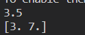
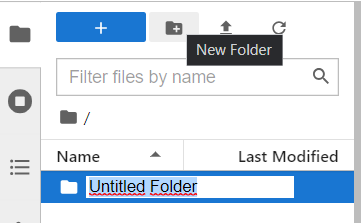
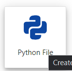


# CHƯƠNG 8: MÔI TRƯỜNG PHÁT TRIỂN TENSORFLOW CHO HỌC MÁY LIÊN QUAN ĐẾN NHẬN DIỆN HÌNH ẢNH

## 8.1. Xây dựng môi trường phát triển TensorFlow
### 8.1.1. Cài đặt TensorFlow
TensorFlow hoạt động trên nhiều hệ điều hành khác nhau và phiên bản cụ thể của TensorFlow có thể thay đổi theo thời gian. Dưới đây là thông tin chung về hệ điều hành và phiên bản TensorFlow:

- **Linux**: Ubuntu, CentOS, Fedora và nhiều bản phân phối Linux khác. Phiên bản Linux và phiên bản TensorFlow có thể thay đổi, nhưng phiên bản 64-bit của TensorFlow thường được hỗ trợ.
- **macOS (Mac)**:  Thường là macOS 10.15 trở lên (Catalina và phiên bản mới hơn). Phiên bản 64-bit của TensorFlow thường được hỗ trợ trên macOS.
- **Windows**: TensorFlow hỗ trợ trên Windows 10 trở lên. Phiên bản TensorFlow thường cung cấp cả phiên bản 32-bit và 64-bit cho Windows.
- **Raspberry Pi**: Chủ yếu Raspberry Pi 3 và Raspberry Pi 4

Giải thích cách cài đặt phiên bản Windows của TensorFlow, cho phép viết các ứng dụng bằng python. Thông tin ở đây có thể áp dụng cho các phiên bản windows khác.
#### 8.1.1.1. Quyết định cài đặt loại TensorFlow nào?
Chọn một trong các loại Tensorflow  sau để cài đặt:

|TensorFlow chạy bằng CPU|TensorFlow hỗ trợ GPU|
| :-: | :-: |
|
Hãy cài đặt phiên bản TensorFlow này nếu hệ thống của bạn không có GPU NVIDIA hoặc nếu bạn không muốn tận dụng GPU cho mục đích học máy và học sâu.

Phiên bản TensorFlow này sẽ hoạt động trên CPU của hệ thống và dễ dàng cài đặt hơn.

|
Hãy cài đặt phiên bản TensorFlow này nếu hệ thống của bạn có GPU NVIDIA và bạn muốn tận dụng sức mạnh tính toán của GPU để tăng hiệu suất cho các ứng dụng liên quan đến học máy và học sâu.

Phiên bản TensorFlow hỗ trợ GPU sẽ cho hiệu suất tốt hơn trên các tác vụ tính toán nặng.
|
#### 8.1.1.2. Xác định cách cài đặt TensorFlow
Chọn một cơ chế để cài đặt TensorFlow. Các lựa chọn được hỗ trợ chính là:

|Pip “gốc”|Anaconda|
| :-: | :-: |
|Pip gốc được cài đặt trực tiếp trên hệ thống mà không cần thông qua môi trường ảo. Vì các cài đặt pip gốc không được đặt trong các thư mục riêng biệt, nên các cài đặt pip có thể can thiệp vào các cài đặt dựa trên Python khác trên hệ thống. Tuy nhiên, nếu như hiểu môi trường pip và Python, việc cài đặt Pip gốc thường chỉ liên quan đến một lệnh duy nhất. Ngoài ra, khi được cài đặt với pip gốc, người dùng có thể chạy các chương trình TensorFlow từ bất kỳ thư mục nào trên hệ thống.|Anaconda cho phép sử dụng Conda để tạo môi trường ảo. Tuy nhiên, gói Conda không được hỗ trợ chính thức và sẽ không được sử dụng.|

#### 8.1.1.3. Cài đặt pip gốc
Nếu chưa cài đặt một trong các phiên bản Python sau trên máy tính, hãy cài đặt phiên bản Python phù hợp. (Cuốn sách này mô tả Python 3.6.2 trong môi trường Windows 7).

• Python 3.5.x 64-bit từ python.org: <https://www.python.org/downloads/release/python-352/> 

• Python 3.6.x 64-bit từ python.org: <https://www.python.org/downloads/release/python-362/> 

TensorFlow hỗ trợ Python 3.5.x, 3.6.x và 3.7.x trên Windows. Truy cập trang web trên và tải xuống và cài đặt phiên bản 3.6.2 trong “Trình cài đặt dựa trên web Windows x86-64”. Tên tệp để tải xuống là “[Windows x86-64 web-based installer](https://www.python.org/ftp/python/3.6.2/python-3.6.2-amd64-webinstall.exe)” (Các tệp cũng được bao gồm trong thư mục Phần mềm trên CD.) Python 3 có trình quản lý gói pip3. Quản trị viên này là chương trình được sử dụng để cài đặt TensorFlow.

Tích vào “Install launcher for all users”

Tích vào “Add Python 3.6 to PATH”

Nó cho phép Python chạy trong bất kỳ thư mục nào trên máy tính bằng cách đặt biến hệ thống.

Việc cài đặt bắt đầu tiến hành.

` `

Khởi động một thiết bị đầu cuối để cài đặt TensorFlow. Sau đó chạy lệnh cài đặt pip3 thích hợp trong thiết bị đầu cuối đó. Nhập lệnh sau để cài đặt phiên bản chỉ dành cho CPU TensorFlow.

|pip3 install –upgrade tensorflow|
| :- |

Nếu lỗi xảy ra do phiên bản pip thấp, hãy nâng cấp và cài đặt lại bằng lệnh sau.

|python -m pip install –upgrade pip|
| :- |

Tiếp tục cài lại TensorFlow như bước trước:

|pip3 install –upgrade tensorflow|
| :- |

#### 8.1.1.4. Cài đặt thư viện matplotlib
Trong thiết bị đầu cuối, nhập lệnh sau để cài đặt thư viện matplotlib:

|pip install matplotlib|
| :- |

Nếu quá trình cài đặt hoàn tất bình thường, hãy kiểm tra cài đặt bằng cách nhập matplotlib qua python như sau:

**Cách cài tensorflow cpu**

Nếu bạn đã cài tensorflow nhưng không được hỗ trợ thì trước hết hãy gỡ cài đặt nó:

|pip uninstall tensorflow|
| :- |

Cài đặt tensorflow-cpu:

|pip install tensorflow-cpu|
| :- |

#### 8.1.1.5. Xác nhận cài đặt
Xác minh cài đặt bằng cách bắt đầu một thiết bị đầu cuối và gọi python bằng cách gõ lệnh python trong shell như sau:

 

Nhập chương trình ngắn sau vào shell tương tác Python. Nhìn vào chương trình, mô-đun TensorFlow được nhập và tạo một nút không đổi gọi là hello. Cần một phiên để chạy nút vừa tạo và chạy phiên.

` `

Khi hệ thống xuất ra các mục sau, thì có nghĩa là đã sẵn sàng để viết chương trình TensorFlow:

` `

Khi chạy chương trình, chữ “b” xuất hiện trước chuỗi đầu ra là viết tắt của Byte.
### 8.1.2. Placeholder
#### 8.1.2.1.
Lần này, nút Placeholder của TensorFlow sẽ được tìm hiểu.

Các nút Placeholder không được khởi tạo khi khai báo. Sau khi khai báo, sẽ không nhận giá trị. Do đó, dữ liệu phải được cung cấp trong thời gian chạy. Dữ liệu ở đây là ánh xạ một Tensor khác tới trình Placeholder.

Trình Placeholder trông như sau:

|
placeholder(

`    `dtype,

`    `shape=None,

`    `name=None

)
|
Trong đó:

- dtype: kiểu dữ liệu

- shape: Loại dữ liệu đầu vào

- name: Tên placeholder
|
| :- | :- |

Hãy xem xét một ví dụ sử dụng trình Placeholder.

Nếu bạn xuất hiện lỗi như trên, lỗi là do TensorFlow 2.0 và các phiên bản mới hơn đã thay đổi cách hoạt động so với TensorFlow 1.x. Trong TensorFlow 2.0, không còn sử dụng tf.placeholder() nữa1

Để khắc phục lỗi này, bạn có thể thử một trong hai cách sau:

|[**Cách 1**](https://stackoverflow.com/questions/37383812/tensorflow-module-object-has-no-attribute-placeholder)|
Sử dụng **tf.compat.v1.placeholder()** thay cho **tf.placeholder()**

Đoạn mã sau đây minh họa cách sử dụng **tf.compat.v1.placeholder():**
|
| :- | :- |

|
**import tensorflow as tf**

**a = tf.compat.v1.placeholder(tf.float32)**
|
| :- |

|||
| :- | :- |
|[**Cách 2**](https://stackoverflow.com/questions/37383812/tensorflow-module-object-has-no-attribute-placeholder)|Đoạn mã sau đây minh họa cách chuyển về chế độ hoạt động của TensorFlow 1.x:|

|
**import tensorflow.compat.v1 as tf**

**tf.disable\_v2\_behavior()**

**a = tf.placeholder(tf.float32)**
|
| :- |

|||
| :- | :- |
Bây giờ hãy quay lại ví dụ và sử dụng cách số 2

|
import tensorflow.compat.v1 as tf

tf.disable\_v2\_behavior()

sess = tf.Session()

a = tf.placeholder(tf.float32)

b = tf.placeholder(tf.float32)

adder\_node = a + b

print(sess.run(adder\_node, feed\_dict={a:2, b:1.5}))

print(sess.run(adder\_node, feed\_dict={a:[2, 3], b:[1, 4]}))
|
| :- |

Kết quả nhận được

 

Sử dụng chức năng nguồn cấp dữ liệu để gán một Tensor cho Placeholder. Sắp đặt một Tensor dưới dạng từ khóa trong feed\_dict khi tạo một phiên. Như trên, Tensor có thể ở dạng một mảng nhiều chiều. Khi tạo các nút giữ chỗ a và b, tạo adder\_nodes và chạy phiên, sử dụng adder\_node và feed\_dict để ánh xạ các Tensor đến các nút a và b và in chúng ra.

` `
#### 8.1.2.2. Hiểu biết về Tensor
TensorFlow, như tên cho thấy, là một khuôn khổ để xác định và thực hiện các tính toán liên quan đến Tensor. Ở đây, Tensor là một kiểu dữ liệu của TensorFlow và phát sinh từ vật lý, là sự khái quát hóa các vectơ và ma trận tiềm năng kích thước lớn hơn.

TensorFlow được thể hiện bên trong như một mảng đa chiều của các kiểu dữ liệu nguyên thủy

Khi viết chương trình TensorFlow, đối tượng chính cần thao tác là tf.Tensor. tf.Tensor đại diện cho một tính toán được xác định một phần tạo ra một giá trị. Chương trình TensorFlow trước tiên xây dựng một biểu đồ của tf.Tensor, mô tả chi tiết cách tính từng Tensor dựa trên các Tensor có sẵn khác, sau đó thực hiện một phần của biểu đồ này để có kết quả mong muốn.

**Tenor có ba thành phần:**

- **Cấp độ:** Nó có nghĩa là số lượng kích thước. Ý nghĩa tương tự là độ hoặc n- chiều. Trong TensorFlow, cấp độ khác với cấp độ ma trận ở phần toán học. Như được hiển thị trong bảng sau, cấp độ trong TensorFlow tương ứng với một thực thể toán học khác.

|**Cấp độ (Rank)**|**Thực thể toán học (Math entity)**|**Giải thích**|
| :-: | :-: | :-: |
|0|Scalar (magnitude only)|Một số vô hướng chỉ có độ lớn mà không có hướng. Trong TensorFlow, đây là một tensor 0D.|
|1|Vector (magnitude and direction)|Một vector có độ lớn và hướng. Trong TensorFlow, đây là một tensor 1D.|
|2|Matrix (table of numbers)|Một ma trận là một bảng số. Trong TensorFlow, đây là một tensor 2D.|
|3|3-Tensor (cube of numbers)|Một tensor 3D có thể được hình dung như một khối lập phương chứa các số. Trong TensorFlow, đây là một tensor 3D.|
|n|
n-Tensor

(you get the idea)
|Một tensor nD có thể có nhiều hơn 3 kích thước. Trong TensorFlow, đây là một tensor nD.|

- **Hình dạng:** Hình dạng của một Tensor là số lượng phần tử trong mỗi chiều. TensorFlow tự động tạo hình trong khi xây dựng biểu đồ. Bảng sau đây cho biết cấp độ, hình dạng và số thứ nguyên liên quan với nhau như thế nào.

|**Cấp độ (Rank)**|**Hình dạng (Shape)**|**Số chiều (Dimension number)**|**Ví dụ (Example)**|
| :-: | :-: | :-: | :-: |
|0|0-D|Một tensor 0-D.|Một số vô hướng (A scalar).|
|1|[D0]|Một tensor 1-D.|Một tensor 1-D với hình dạng [5].|
|2|[D0, D1]|Một tensor 2-D.|Một tensor 2-D với hình dạng [3, 4].|
|3|[D0, D1, D2]|Một tensor 3-D.|Một tensor 3-D với hình dạng [1, 4, …].|
|n|…|Một tensor n-D.|… hình dạng [D0, D1, …, Dn-1]|

- **Kiểu loại:** Tenor có một kiểu dữ liệu. Xem trang tf.DType sau đây để biết danh sách đầy đủ các loại dữ liệu. ( <https://www.tensorflow.org/api_docs/python/tf/DType> )

Không thể có tf.Tensor với nhiều loại dữ liệu, nhưng có thể tuần tự hóa bất kỳ cấu trúc dữ liệu nào thành một chuỗi và lưu trữ nó trong tf.Tensor. Cũng có thể truyền tf.Tensor từ loại dữ liệu này sang loại dữ liệu khác bằng tf.cast.

### 8.1.3. Cài đặt JupyterLab
Jupiter Labs là giao diện người dùng dựa trên Web thế hệ tiếp theo của Jupiter. Có thể thử nó thông qua Binder.

Có hai cách để cài đặt bằng anaconda và pip. Trong trường hợp này, việc cài đặt được thực hiện bằng cách sử dụng pip.

Đầu tiên hãy mở một cửa sổ lệnh và cài đặt Jupiter bằng cách sử dụng lệnh sau trong cửa sổ lệnh:

|pip install jupyterlab|
| :- |

Xác nhận thông báo rằng cài đặt hoàn tất thành công.

Jupiter Labs yêu cầu Jupiter Notebook phiên bản 4.3. Để kiểm tra phiên bản của gói notebook đã cài đặt, hãy làm như sau:

|jupyter notebook --version|
| :- |

Nếu đang sử dụng phiên bản Notebook Jupiter trước 5.3, hãy chạy lệnh sau để bật tiện ích mở rộng Jupiter Lab Server:

|jupyter serverextension enable -- py jupyterlab -- sys-prefix|
| :- |

Jupiter Labs hiện đang hoạt động với phiên bản mới nhất của các trình duyệt sau:

- Firefox
- Chrome
- Safari

Nó hoạt động trong các trình duyệt trước đó nhưng không được bảo đảm.

Jupiter Lab sử dụng các biến CSS để tạo kiểu. Internet Explorer 11+ hoặc Edge 14 không hỗ trợ các biến CSS.

Trước khi chạy Jupiter Lab, hãy tạo một không gian làm việc và di chuyển nó vào thư mục đó.

|
mkdir jupyter

cd jupyter
|
| :- |

Để chạy Jupiter Lab, sử dụng lệnh sau:

|jupyter lab|
| :- |

Jupiter Labs sẽ tự động mở trong trình duyệt. Tuy nhiên, nếu mở nó trong IE, có thể truy cập Jupiter Labs bằng cách nhập URL vào trình duyệt trong Chrome. Các phiên của Jupiter Lab luôn ở trong không gian làm việc. Không gian làm việc mặc định thường là URL “/ lab”.

` `

Để biết thêm thông tin về URL của Jupiter Labs, xem URL Jupiter Labs sau đây:

<https://jupyterlab.readthedocs.io/en/latest/user/urls.html#urls> 

Lần đầu tiên thử kết nối, hãy thử đăng nhập bằng cách sao chép và dán URL chứa mã token vào trình duyệt Chrome. Hoặc, truy cập vào

<http://localhost:8888/lab> 

và nhập mã token được hiển thị trong cửa sổ lệnh.

` `

Thao tác này sẽ mở Jupiter Lab trong trình duyệt:

Đầu tiên, tạo một thư mục có tên là TensorFlow bằng cách nhấp vào nút Thư mục mới nằm dưới tab menu trên cùng.

` `

Tạo mới file **“hellotensorflow.py”** bằng 

` `Sau đó di chuyển nó vào thư mục TensorFlow đã tạo bên trong thư mục Jupiter của không gian làm việc Jupiter. Sau đó bấm đúp chuột vào tập tin để hiển thị nó ở bên phải trình duyệt. Tệp được phân định bằng tab được định vị như sau bằng cách kéo tab. Sau đó nhấn nút Notebook Python để chọn trình khởi chạy.

Khi trình khởi chạy được tạo, sao chép và dán mã Python như bên dưới và nhấn nút Run hình tam giác ở trên cùng trình khởi chạy để chạy nó. Nút Run cũng có thể được chạy bằng cách nhấn Shift + Enter.

` `

Kết quả thực hiện giống như kết quả lập trình TensorFlow trước đó.
## 8.2 API TensorFlow
### 8.2.1. Giới thiệu API TensorFlow
Giới thiệu cách thực hiện các thao tác sau đây thông qua việc lập trình bằng API TensorFlow.

- Quản lý chương trình TensorFlow (tf.Graph) và thời gian chạy TensorFlow (tf.Session).
- Chạy tác vụ TensorFlow bằng tf.Session.
- Sử dụng các thành phần cấp cao (bộ dữ liệu, lớp và cột tính năng) trong môi trường cấp thấp.
- Xây dựng một vòng lặp đào tạo.
#### 8.2.1.1. Giá trị Tensor
Trong dòng Tensor, đơn vị chính của dữ liệu là Tensor. Tensor bao gồm một tập hợp các giá trị gốc được sắp xếp theo bất kỳ số lượng kích thước nào. Cấp độ của một Tensor là số lượng kích thước, hình dạng của nó là một tập hợp số nguyên mà chỉ rõ độ dài của mảng dọc theo mỗi chiều. Dưới đây là một số ví dụ về giá trị Tensor.

Giải thích:

***3.**: Đây là một tensor cấp độ 0, còn được gọi là một số vô hướng (scalar). Nó không có hình dạng (shape) vì nó chỉ là một giá trị duy nhất.*

***[1., 2., 3.]**: Đây là một tensor cấp độ 1, còn được gọi là một vector. Nó có hình dạng [3] vì nó chứa 3 giá trị.*

***[[1., 2., 3.], [4., 5., 6.]]**: Đây là một tensor cấp độ 2, còn được gọi là một ma trận. Nó có hình dạng [2, 3] vì nó chứa 2 hàng và 3 cột.*

***[[[1., 2., 3.]], [[7., 8., 9.]]]**: Đây là một tensor cấp độ 3. Nó có hình dạng [2, 1, 3] vì nó chứa 2 mảng, mỗi mảng chứa 1 hàng và 3 cột.*

Dòng Tensor sử dụng các mảng numpy để biểu diễn các giá trị Tensor.
#### 8.2.1.2. Vùng TensorFlow
Chương trình lõi dòng Tensor có thể được coi là bao gồm hai phần riêng biệt. Thông tin chi tiết có thể được tìm thấy thông qua các đường dẫn dưới đây.

- Tạo biểu đồ tính toán (tf.Graph)

<https://www.tensorflow.org/api_docs/python/tf/Graph> 

- Chạy đồ thị tính toán (tf.Session)

<https://www.tensorflow.org/api_docs/python/tf/Session>

#### 8.2.1.3. Đồ thị
Biểu đồ hoạt động là sự sắp xếp của một chuỗi các thao tác TensorFlow dưới dạng biểu đồ. Đồ thị bao gồm hai loại đối tượng.

- **tf.Operation (or “ops”)**: Các nút trong biểu đồ. Các hoạt động mô tả các tính toán tiêu thụ và tạo ra các Tensor.
- **tf.Tensor**: Các cạnh của biểu đồ. Nó đại diện cho giá trị sẽ chạy qua biểu đồ. Hầu hết các hàm TensorFlow trả về tf.Tensors.

Hãy cùng viết một biểu đồ tính toán đơn giản. Yếu tố cơ bản nhất là một hằng số. Các hàm Python xây dựng các hoạt động nhận các giá trị Tensor trong ứng dụng. Kết quả không yêu cầu đầu vào. Khi được thực hiện, nó sẽ in giá trị được truyền cho hàm tạo. Ở đây chúng ta tạo hai hằng số dấu phẩy động.

|
a = tf.constant(3.0, dtype=tf.float32)

b = tf.constant(4.0) # also tf.float32 implicitly

total = a + b

print(a)

print(b)

print(total)
|
| :- |

Câu lệnh in tạo ra như sau:

Nếu in một Tensor, 3.0, 4.0 và 7.0 sẽ không in như mong đợi. Câu lệnh trên chỉ tạo một biểu đồ tính toán. tf.Tensor này phản ánh kết quả của nhiệm vụ được thực hiện.

Mỗi tác vụ trong biểu đồ được đặt một tên duy nhất. Tên này tách biệt với tên được gán cho đối tượng trong Python. Tensor được đặt tên theo hoạt động được lập chỉ mục đầu ra, như là “add: 0” ở trên.
#### 8.2.1.4. Phiên làm việc
Để đánh giá Tensor, khởi tạo một đối tượng tf.Session được gọi một cách không chính thức là một phiên.

Phiên sẽ tóm lược trạng thái thời gian chạy và thực hiện các hoạt động Tensor. Nếu tf.Graph tương đương với .py, tf.Session giống như một tệp thực thi Python.

Đoạn mã sau tạo một đối tượng tf.Session và sau đó dùng phương thức thực thi để tính tổng Tensor được tạo ở trên.

|
sess = tf.Session()

print(sess.run(total))
|
| :- |

Khi yêu cầu đầu ra của một nút với Session.run, TensorFlow chạy tất cả các nút chạy về qua biểu đồ và cung cấp đầu vào cho nút đầu ra yêu cầu. Do đó, nó in giá trị mong đợi 7.0.

` `

Có thể truyền nhiều Tensor cho tf.Session.run. Phương thức thực thi xử lý rõ ràng tất cả các kết hợp của bộ dữ liệu hoặc từ điển, như trong ví dụ sau:

|print(sess.run({'ab': (a, b), 'total': total}))|
| :- |

Trả về kết quả trong cùng một cấu trúc bố trí:

Trong khi chạy tf.Session.run, tf.Tensor chỉ có một giá trị. Ví dụ: đoạn mã sau tạo ra một tf.Tensor gọi **tf.random\_uniform** để tạo ra một vectơ ba phần tử tùy ý (với các giá trị trong [0,1]). 

|
[0.52917576, 0.64076328, 0.68353939]

[0.66192627, 0.69126778, 0.06254101]

(

`    `array([ 1.8840756, 1.87149239, 1.84057522], dtype=float32),

`    `array([ 2.8840756, 2.87149239, 2.84057522], dtype=float32)

)
|
| :- |

Một số hàm TensorFlow trả về tf.Operations thay vì tf.Tensors. Kết quả của chạy chương trình là None. Không truy xuất giá trị bằng cách thực hiện các hoạt động gây ra tác dụng phụ.

Cho đến nay, chúng ta mới chỉ xem xét các API cơ bản nhất của TensorFlow. Ngoài ra còn có một số lượng API đáng kể, vì vậy hãy tìm hiểu thêm về TensorFlow qua trang chủ.

